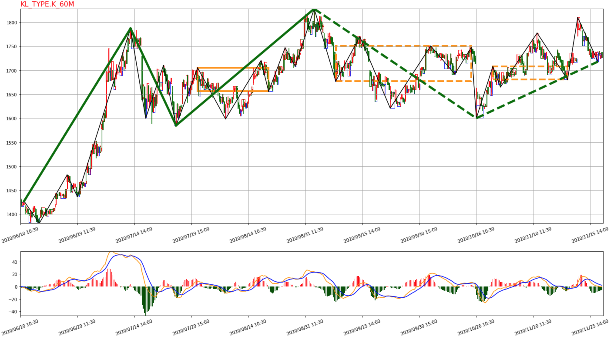
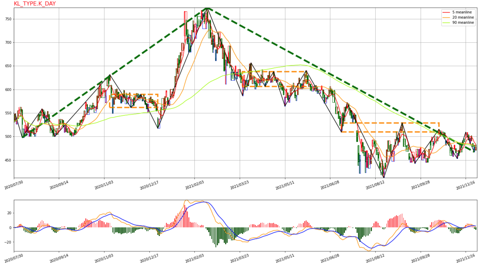
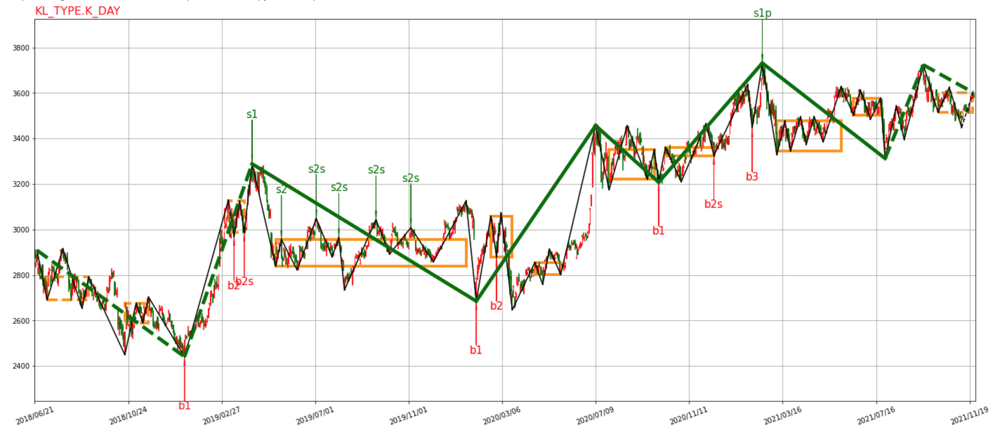
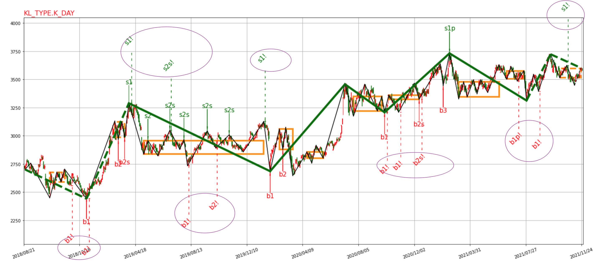
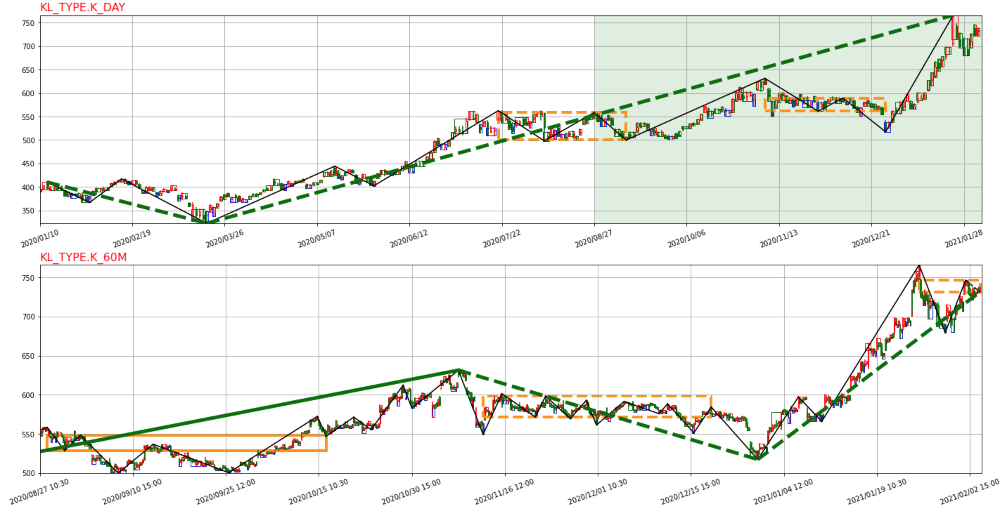
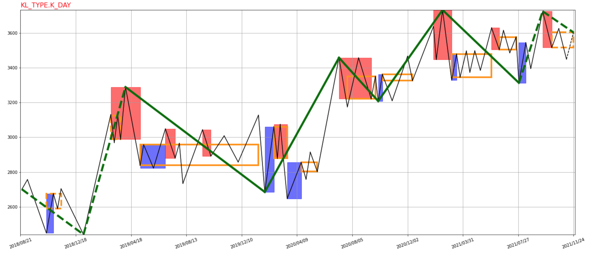
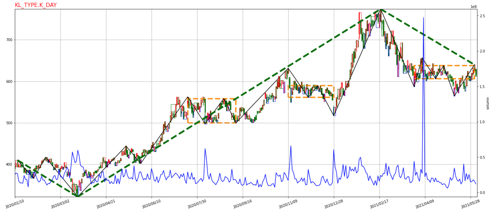

# 缠论框架使用文档
本框架支持：
- 计算缠论基本元素，包括分形，笔，线段，中枢，买卖点
    - 部分元素支持继承基类，根据自己的逻辑开发，如笔，线段，买卖点
- 支持多级别联立计算
    - 支持区间套计算买卖点
- 支持配置MACD， 均线等计算指标
    - 亦支持配置多个不同的指标参与计算，如换手率，交易量等
- 支持自定义策略开仓，平仓，及回测
- 支持读取不同数据源数据
    - 提供自行开发数据读取解析能力
- 支持全局绘制/逐步回放 画图&保存
    - 默认基于matplotlib
    - 支持提取画图元素信息，可以对接任意画图引擎，如bokeh等
- 支持方便部署成API服务

## 基本使用方法
### demo
```python
from chan import CChan
from common.CEnum import DATA_SRC, KL_TYPE
from plot.plotDriver import CPlot_driver
from plot.animatePlotDriver import CAnimate_driver
from ChanConfig import CChanConfig
chan = CChan(
    code="sh.600000",
    begin_time="2020-01-01",
    end_time="2021-08-10",
    data_src=DATA_SRC.BAO_STOCK,
    lv_list=[KL_TYPE.K_DAY, KL_TYPE.K_30M],
    config=CChanConfig({})
)

plot_driver = CPlot_driver(
    chan,
    plot_config={},
    plot_para={},
)
# plot_driver.save2img("xxxx/demo.png")

# CAnimate_driver(
#             chan,
#             plot_config={},
#             plot_para={},
#         )
```
需要计算缠论相关数据，仅需第一行；
如果需要画图:
- 单幅图使用CPlot_driver
- 如果需要看回放动画，则使用CAnimate_driver



其中涉及到的参数，CChanConfig，plot_config，plot_para见下文介绍。

### CChan类介绍
接受参数包括：
- code：股票代码，具体格式取决于数据源格式
- begin_time：开始时间，默认为None（至于None怎么理解,也取决于数据源格式）
- end_time：结束时间，默认为None（至于None怎么理解,也取决于数据源格式）
- data_src：数据源，框架提供：
    - DATA_SRC.FUTU：富途(默认)
    - DATA_SRC.BAO_STOCK：BaoStock
    - DATA_SRC.TU_SHARE：tushare
    - "custom:文件名:类名"：自定义解析器
        - 框架默认提供一个demo为："custom:CustomDataDemo.CStockFileReader"
        - 自己开发参考下文『数据源解析器』
- lv_list：K线级别，必须从大到小，默认为`[KL_TYPE.K_DAY, KL_TYPE.K_60M]`，可选：
    - DK_TYPE.K_1M
    - DK_TYPE.K_DAY
    - DK_TYPE.K_WEEK
    - DK_TYPE.K_MON
    - DK_TYPE.K_YEAR
    - DK_TYPE.K_5M
    - DK_TYPE.K_15M
    - DK_TYPE.K_30M
    - DK_TYPE.K_60M
    - DK_TYPE.K_3M
    - DK_TYPE.K_QUARTER
- config：CChanConfig类，参见下文CChanConfig配置

| 如果需要部署成服务对外提供，`CChan.toJson()`可返回所有相关信息。

## 配置参数介绍
### CChanConfig 配置
该参数主要用于配置计算，支持配置参数如下：
- 缠论计算相关：
    - zs_mode：中枢模式
        - bi: 笔中枢（默认）
        - kline: 3K线重叠部分（一般用于最小级别）
        - trend：走势中枢，由3个次级别走势重叠部分构成
        - auto: 最小级别用`kline`， 其余级别用`trend`
    - zs_combine：是否进行中枢合并，默认为True
    - zs_combine_mode： 中枢合并模式
        - zs：两中枢区间有重叠才合并（默认）
        - peak：两中枢有K线重叠就合并
    - bi_strict：只用严格笔，默认为Ture
    - mean_metrics：均线计算周期，数组，默认为空[]
        - 例子：[5,20]
    - triger_step：是否回放逐步返回，默认为False
        - 用于逐步回放绘图时使用，此时CChan会变成一个生成器，没读取一根新K线就会计算一次当前所有指标，并把自身返回给CAnimate_driver绘图
    - skip_step：triger_step为True时有效，跳过前面N步不返回，默认为0
    - seg_algo：线段计算方法
        - chan：利用特征序列来计算（默认）
        - 1+1：都业华版本1+1终结顺发
        - break：线段破坏定义
- 买卖点相关：
    - divergence_rate：1类买卖点背驰比例，即离开中枢的笔的MACD指标相对于进入中枢的笔，默认为0.9
    - min_zs_cnt：1类买卖点至少要经历几个中枢，默认为1
    - max_bs2_rate：2类买卖点那一笔回测最大比例，默认为0.618
        - 如果是1.0，那么相当于允许回测到1类买卖点的位置
    - bs1_peak：1类买卖点位置是否必须是整个中枢最低点，默认为True
    - macd_algo：MACD指标算法（可自定义）
        - peak：红绿柱最高点（绝对值），默认
        - full_area：整根笔对应的MACD的面积
        - area：整根笔对应的MACD的面积（只考虑相应红绿柱）
    - bs_type：关注的买卖点类型，逗号分隔，默认"1,2,3,2s,1p"
        - 1,2,3：分别表示1，2，3类买卖点
        - 2s：类二买卖点
        - 1p：盘整背驰1类买卖点
- 自定义策略类相关（关于策略类详细介绍参见后文）：
    - stragety_cls：自定义策略类，默认为None
        - 框架自带实现类别为`CCustomStragety`
    - stragety_para：需要传递给自定义买卖点的参数，字典，默认为{}
        - 如果使用的是自带类`CCustomStragety`，支持配置参数包括：
            - strict_open：严格开仓条件，即如果对一个买卖点当下无法找到合适的买卖时机，就放弃。默认为True。
            - use_qjt：使用区间套计算买卖点（多级别下才有效），默认为True。
            - cover_stragety：平仓策略（可自定义）。
                - bsp：买点买，卖点卖，默认
                    - 可能由于小转大没找到平仓点导致亏损
                - bi：当前笔结束时
                    - 收益不高
            - short_shelling：是否做空，默认为True
    - only_judge_last：只判断最后一个K线的买卖点类型/买卖点信号，默认为False。
        - 开启后速度非常快，适合用于海量选股时使用

其中`divergence_rate`,`min_zs_cnt`,`max_bs2_rate`,`macd_algo`,`bs1_peak`,`stragety_para`，`bs_type`这几个指标可以分别对买卖点各自设置，如果不单独设置，则是对买卖点同时生效。
单独设置时后面加`-buy`或`-sell`，比如 min_zs_cnt-buy=2，min_zs_cnt-sell=1

demo配置为:
```
config = CChanConfig({
    "zs_mode": "bi",
    "zs_combine": True,
    "zs_combine_mode": "zs",
    "bi_strict": True,
    "mean_metrics": [],
    "triger_step": False,
    "skip_step": 0,
    "seg_algo": "break",
    "divergence_rate": 0.9,
    "min_zs_cnt": 1,
    "max_bs2_rate": 0.618,
    "bs1_peak": True,
    "macd_algo": "peak",
    "bs_type": '1,2,3,2s,1p',
    "stragety_cls": CCustomStragety,
    "only_judge_last": False,
    "stragety_para": {
        "strict_open": True,
        "use_qjt": True,
        "cover_stragety": "bsp",
        "short_shelling": True,
    }
})
```

### plot_config配置
CPlot_driver和CAnimate_driver参数，用于控制绘制哪些元素
- plot_kline：画K线，默认为False
- plot_kline_combine：画合并K线，默认为False
- plot_bi：画笔，默认为False
- plot_seg：画线段，默认为False
- plot_eigen：画特征序列（一般调试用），默认为False
- plot_zs：画中枢，默认为False
- plot_macd：画MACD图（图片下方额外开一幅图），默认为False
- plot_mean：画均线，默认为False
- plot_bsp：画理论买卖点，默认为False
- plot_cbsp：画自定义策略买卖点位置，默认为False
- plot_extrainfo：绘制配置的额外信息（在另一根y轴上），默认为False

均线 & MACD：


买卖点：


#### bsp，cbsp区别
bsp（buy sell point）和cbsp（custom buy sell point）是有差异的，前者是根据走势和定义可以计算出来过去各个买卖点的位置，而cbsp必须通过实现CChanConfig中的stragety_cls参数，实现一个策略类，该策略类在每根新K线出现时判断当下是否是新的买卖点。

即一个是基于历史的绝对正确的，一个是基于当下，不一定正确的。

比如下图，表示带`！`且是虚线标示的买卖点就是cbsp，实线不带`!`的是bsp。


### plot_para配置
用于具体画图细节控制，具有两级，比如一级是figure，二级是w，那么配置figure_w=xxx即可。
- figure：图相关
    - w：宽度，默认为20
    - h：高度，默认为10
    - macd_h：MACD图高度相对于h的比例，默认为0.3
    - only_top_lv：是否只画最高级别，默认为False
    - x_range：绘制只画最后x_range根K线范围，为0表示全部，默认为0
    - grid：网格，x/y/xy分别是只画横轴，纵轴，都画
- ukl：k线相关
    - width：宽度，默认为0.4
    - rugd：红涨绿跌，默认为True
- ckl：合并K线相关
    - width：宽度，默认为0.4
- bi：笔
    - emph_type：需要突出的笔的类别，默认为[]，可选值包括：
        - BI_TYPE.STRICT
        - BI_TYPE.SUB_VALUE：次高低点成笔
        - BI_TYPE.TIAOKONG_THRED：按比例跳空笔（参见都业华课程）
        - BI_TYPE.TIAOKONG_VALUE：按值跳空笔
        - BI_TYPE.DAHENG：打横笔
        - BI_TYPE.TUIBI：推笔
        - BI_TYPE.UNSTRICT：宽笔
    - color：笔颜色，默认为'black'
    - emph_color：突出笔颜色，默认为'red'
    - show_num：笔中间标上序号，默认为False
    - num_color：序号颜色，默认为'red'
    - sub_lv_cnt：次级别只画本级别的多少笔，默认为None，即为全部
        - 参考下图，sub_lv_cnt=6，即次级别绘制范围是本级别最后6笔
        - 注意：不可和seg_sub_lv_cnt同时设置
    - facecolor：如果sub_lv_cnt非空，那么本级别需要标示出次级别对应的本级别范围，该范围颜色为facecolor，默认为'green'
    - alpha：facecolor的透明度，默认为0.1



- seg:线段
    - width:宽度，默认为5
    - color：颜色，默认为'r'
    - sub_lv_cnt：次级别只画本级别的多少线段，默认为None，即为全部
        - 注意：不可和bi_sub_lv_cnt同时设置
    - facecolor：如果sub_lv_cnt非空，那么本级别需要标示出次级别对应的本级别范围，该范围颜色为facecolor，默认为'green'
    - alpha：facecolor的透明度，默认为0.1
- eigen：特征序列（`CChanConfig`中`seg_algo`设置为`chan`时有效）
    - color_top：顶分型颜色，默认为'r'
    - color_bottom：底分型颜色，默认为'b'
    - color_up：上升分形颜色，默认为'green'
    - color_down：下降分形颜色，默认为'pink'
    - aplha：透明度，默认为0.5
    - only_peak：只画顶底分型，默认为True



- zs：中枢
    - color：颜色，默认为'k'
    - linewidth：宽度，最小为2，默认值为2
    - sub_linewidth：子中枢宽度（在开启中枢合并情况下），默认值为0.5
- macd：MACD
    - width：红绿柱宽度，默认为0.4
- mean：均线，无可配置项
- bsp：买卖点
    - buy_color：买点颜色，默认为'r'
    - sell_color：买点颜色，默认为'g'
    - fontsize：字体大小，默认为15
    - arrow_l：箭头占图总高度(即figure_h)比例，默认为0.3
    - arrow_h：箭头头部占箭头长度比例，默认为0.1
    - arrow_w：箭头宽度，默认为1
- cbsp：自定义买卖点
    - buy_color：买点颜色，默认为'r'
    - sell_color：买点颜色，默认为'g'
    - fontsize：字体大小，默认为15
    - arrow_l：箭头占图总高度(即figure_h)比例，默认为0.3
    - arrow_h：箭头头部占箭头长度比例，默认为0.1
    - arrow_w：箭头宽度，默认为1
- extrainfo：
    - info：绘制内容
        - volumn：成交量（默认）
        - turnover：成交额
        - turnover_rate：换手率
    - color：颜色，默认为'b'



## 自定义开发
### 数据元解析器

> 参考dataSrc/CustomDataDemo.py

实现一个类，继承自`CCommonStockApi`，接受输入参数为code, k_type, begin_date, end_date；
并在该类里面实现两个方法：

- `get_kl_data(self)`：该方法为一个生成器，yield返回每一根K线信息`KLine_Unit(idx, k_type, item_dict)`，其中item为：
```
{
    CCommonStockApi.FIELD_TIME: time,  # 必须是框架实现的CTime类
    CCommonStockApi.FIELD_OPEN: float(_open),
    CCommonStockApi.FIELD_CLOSE: float(_close),
    CCommonStockApi.FIELD_LOW: float(_low),
    CCommonStockApi.FIELD_HIGH: float(_high),
    CCommonStockApi.FIELD_VOLUME: float(volume),
    CCommonStockApi.FIELD_TURNOVER: float(amount),
    CCommonStockApi.FIELD_TURNRATE: float(turn),
}
```

- `SetBasciInfo()`：用于设置股票名字和其他需要用到的信息

### 笔
实现一个类，继承自`CBi_List`，实现一个函数`update_bi(self, klc: KLine, last_klc: KLine)`


### 线段
实现一个类，继承自`CSeg_List_Comm`，实现一个函数`update(self, bi_list: CBi_List)`，bi_list包含了所有已知笔的信息

已实现三个类，分别是用特征线段序列，线段破坏定义，1+1终结来计算线段。

### 买卖点
实现一个类，继承自`CBSPointList`，实现一个函数`cal(self, bi_list: CBi_List, seg_list: CSeg_List_Comm)`：
- bi_list包含所有笔的信息
- seg_list包含所有线段的信息（内部可以通过`seg_list[n].zs_lst[i]`来获取第n个线段的第i个中枢）

### 策略类

一旦设置了CChanConfig中的stragety_cls参数，那么每新增一根K线都会调用该类的update函数来计算当下是否是买卖点，其中update函数会调用用户开发的try_open和try_close函数。

实现一个类，继承自CStragety，需要实现try_open和try_close两个类，分别是开仓和平仓，接受的参数都是CChan类（包含所有级别的信息）和lv（当前级别，`chan[lv]`为当前级别信息）

`def try_open(self, chan: CChan, lv)`:判断当下最后一根出现时是否是买卖时机，如果是则返回CCustomBSP来设置买卖点相关信息，否则返回None

`def try_close(self, chan: CChan, lv)`:判断当下对之前已经开仓且未平仓的买卖点决定是否平仓,如果需要平仓,调CCustomBSP.do_close(price: float, close_klu: KLine_Unit, reason: str, quota=None)即可。

### 中枢

| 暂未开放自定义开发，已实现笔中枢，走势中枢，3K线重叠中枢，可根据`zs_mode`参数配置。