<p align="center">

</p>

```
             ██████╗██╗  ██╗ █████╗ ███╗   ██╗   ██████╗ ██╗   ██╗
            ██╔════╝██║  ██║██╔══██╗████╗  ██║   ██╔══██╗╚██╗ ██╔╝
            ██║     ███████║███████║██╔██╗ ██║   ██████╔╝ ╚████╔╝
            ██║     ██╔══██║██╔══██║██║╚██╗██║   ██╔═══╝   ╚██╔╝
            ╚██████╗██║  ██║██║  ██║██║ ╚████║██╗██║        ██║
             ╚═════╝╚═╝  ╚═╝╚═╝  ╚═╝╚═╝  ╚═══╝╚═╝╚═╝        ╚═╝
```

<p><a href="https://github.com/Vespa314/chan.py/stargazers"></a></p>

- 讨论组：<a href="https://t.me/zen_python">Telegram</a>
- [快速上手指南](./quick_guide.md)


**特别说明①**：当前公开部分代码暂时只包含基本的静态计算能力，暂未包含策略类，特征，模型，automl框架，交易引擎对接等；

完整代码22000行左右，公开版约5300行；本README对应的是完整版(可能在某些地方使用上和公开版本代码不一致)，尽量参考[快速上手指南](./quick_guide.md)；

如有使用疑惑，欢迎讨论/邮件联系。


**特别说明②**：依赖最低版本为python3.11；由于本项目是高度计算密集型，鉴于python3.11发布且运算速度大幅提升，实测相比于python 3.8.5计算时间缩短约16%，故后续开发均基于python3.11；


---
# 缠论框架使用文档
- [缠论框架使用文档](#缠论框架使用文档)
  - [功能介绍](#功能介绍)
    - [1. 缠论基本元素计算](#1-缠论基本元素计算)
    - [2. 策略买卖点开发](#2-策略买卖点开发)
    - [3. 策略对接机器学习框架](#3-策略对接机器学习框架)
    - [4. 线上交易](#4-线上交易)
  - [目录结构 \& 文件说明](#目录结构--文件说明)
  - [安装方法](#安装方法)
    - [配置文件介绍](#配置文件介绍)
    - [自行开发必要工具类](#自行开发必要工具类)
  - [缠论计算使用方法](#缠论计算使用方法)
    - [特殊名词/变量名解释](#特殊名词变量名解释)
    - [使用 demo](#使用-demo)
    - [CChan 类介绍](#cchan-类介绍)
    - [CChanConfig 配置](#cchanconfig-配置)
      - [精确设置配置](#精确设置配置)
      - [CChanConfig 配置 Demo](#cchanconfig-配置-demo)
    - [画图配置](#画图配置)
      - [plot\_config](#plot_config)
      - [plot\_para](#plot_para)
    - [中枢算法](#中枢算法)
      - [段内中枢](#段内中枢)
      - [跨段中枢](#跨段中枢)
  - [模型](#模型)
  - [特征](#特征)
    - [默认特征情况](#默认特征情况)
  - [交易系统](#交易系统)
    - [交易后端数据库](#交易后端数据库)
    - [信号计算](#信号计算)
    - [交易引擎](#交易引擎)
    - [典型流程](#典型流程)
  - [自定义开发](#自定义开发)
    - [数据接入](#数据接入)
    - [实时数据接入](#实时数据接入)
    - [笔模型](#笔模型)
    - [线段模型](#线段模型)
    - [bsp 买卖点](#bsp-买卖点)
    - [cbsp 买卖点策略](#cbsp-买卖点策略)
      - [区间套策略示例](#区间套策略示例)
    - [模型类](#模型类)
      - [模型开发](#模型开发)
        - [CModelGenerator](#cmodelgenerator)
        - [CDataSet](#cdataset)
        - [外部接口](#外部接口)
      - [模型接入](#模型接入)
      - [Automl](#automl)
  - [其他](#其他)
    - [COS](#cos)
    - [Notion](#notion)
    - [试题功能](#试题功能)
  - [其他不值一提的优化](#其他不值一提的优化)
  - [碎碎念](#碎碎念)
    - [12月15日补充](#12月15日补充)
      - [实验仓位](#实验仓位)
      - [港股](#港股)
      - [美股](#美股)
  - [Star history](#star-history)
  - [咖啡？NO!](#咖啡no)

## 功能介绍
本框架从使用深度上来讲，分四种不同的级别：

### 1. 缠论基本元素计算
- 计算缠论基本元素，包括分形，笔，线段，中枢，买卖点
    - 部分元素支持继承基类，根据自己的逻辑开发，如笔，线段，买卖点
    - 基础元素均提供多种可配置项 及 自定义开发能力
    - 支持父级别计算，如线段中枢，线段的分段，线段买卖点等
- 支持多级别联立计算
    - 支持区间套计算买卖点
- 支持配置MACD， 均线，布林线，Demark等计算指标
    - 亦支持配置多个不同的指标参与计算，如换手率，交易量等
- 支持读取不同数据源数据
    - 对接 futu，akshare，baostock数据
    - 读取本地数据
    - 提供自行开发数据读取解析能力
    - 支持高性能本地离线数据更新 & 存储能力
- 支持全局绘制/逐步回放 画图&保存
    - 默认基于matplotlib
    - 支持提取画图元素信息，可以对接任意画图引擎，如bokeh等
- 支持方便部署成 API 服务

### 2. 策略买卖点开发
- 支持计算形态学买卖点
- 支持自定义策略，计算动力学买卖点
- 支持配置背驰算法

### 3. 策略对接机器学习框架
- 支持通过机器学习模型对买卖点进行打分
    - 默认对买卖点提供 500+个特征
    - 提供机器学习开发框架，实现数据接入，模型训练预测，模型读写等接口即可上线
        - 默认提供XGB，LightGBM，MLP深度学习网络三种模型
    - 提供回测，评估框架
- 提供AutoML超参搜索引擎

### 4. 线上交易
- 支持线上线下模型/特征一致性校验
- 支持对接 Futu 交易引擎
    - 可对接模拟盘 & 实盘
    - 提供开仓，平仓，实时跟踪股价能力
- 支持接入实时股价数据接口
    - 默认提供 sina，pytdx，futu，akshare接口
- 支持mysql，sqlite两种后端数据库，并对缠论数据库提供专门 API

## 目录结构 & 文件说明
```
.
├── 📁 Bi # 笔
│   ├── 📄 BiConfig.py: 配置类
│   ├── 📄 BiList.py: 笔列表类
│   └── 📄 Bi.py: 笔类
├── 📁 Seg: 线段类
│   ├── 📄 Eigen.py: 特征序列类
│   ├── 📄 EigenFX.py: 特征序列分形类
│   ├── 📄 SegConfig.py: 线段配置类
│   ├── 📄 SegListComm.py: 线段计算框架通用父类
│   ├── 📄 SegListChan.py: 线段计算：根据原文实现
│   ├── 📄 SegListDef.py: 线段计算：根据定义实现
│   ├── 📄 SegListDYH.py: 线段计算：根据都业华1+1突破实现
│   └── 📄 Seg.py: 线段类
├── 📁 ZS: 中枢类
│   ├── 📄 ZSConfig.py: 中枢配置
│   ├── 📄 ZSList.py: 中枢列表类
│   └── 📄 ZS.py: 中枢类
├── 📁 KLine: K线类
│   ├── 📄 KLine_List.py: K线列表类
│   ├── 📄 KLine.py: 合并K线类
│   ├── 📄 KLine_Unit.py: 单根K线类
│   └── 📄 TradeInfo.py: K线指标类（换手率，成交量，成交额等）
├── 📁 BuySellPoint: 形态学买卖点类（即bsp）
│   ├── 📄 BSPointConfig.py: 配置
│   ├── 📄 BSPointList.py: 买卖点列表类
│   └── 📄 BS_Point.py: 买卖点类
├── 📁 Combiner: K线，特征序列合并器
│   ├── 📄 Combine_Item.py: 合并元素通用父类
│   └── 📄 KLine_Combiner.py: K线合并器
├── 📁 Common: 通用函数
│   ├── 📄 cache.py: 缓存装饰器，大幅提高计算性能
│   ├── 📄 CEnum.py: 所有枚举类，K线类型/方向/笔类型/中枢类型等
│   ├── 📄 ChanException.py: 异常类
│   ├── 📄 CTime.py: 缠论时间类（可处理不同级别联立）
│   ├── 📄 func_util.py: 通用函数
│   ├── 📄 send_msg_cmd.py: 消息推送
│   ├── 📄 tools.py: 工具类
│   ├── 📄 CommonThred.py: 线程类
│   └── 📄 TradeUtil.py: 交易通用函数
├── 📁 Config: 配置
│   ├── 📄 config.sh shell脚本读取配置
│   ├── 📄 demo_config.yaml: demo配置
│   ├── 📄 EnvConfig.py: python读取配置类
├── 📁 CustomBuySellPoint: 自定义动力学买卖点类（即cbsp）
│   ├── 📄 Strategy.py: 通用抽象策略父类
│   ├── 📄 CustomStrategy.py: demo策略1
│   ├── 📄 SegBspStrategy.py: demo策略2
│   ├── 📄 ExamStrategy.py: 生成买卖点判断试题的策略
│   ├── 📄 CustomBSP.py: 自定义买卖点
│   └── 📄 Signal.py: 信号类
├── 📁 DataAPI: 数据接口
│   ├── 📄 CommonStockAPI.py: 通用数据接口抽象父类
│   ├── 📄 AkShareAPI.py: akshare数据接口
│   ├── 📄 BaoStockAPI.py: baostock数据接口
│   ├── 📄 ETFStockAPI.py: ETF数据解耦接口
│   ├── 📄 FutuAPI.py: futu数据接口
│   ├── 📄 OfflineDataAPI.py: 离线数据接口
│   ├── 📄 MarketValueFilter.py: 股票市值过滤类
│   └── 📁 SnapshotAPI: 实时股价数据接口
│       ├── 📄 StockSnapshotAPI.py: 统一调用接口
│       ├── 📄 CommSnapshot.py: snapshot通用父类
│       ├── 📄 AkShareSnapshot.py: akshare接口，支持a股，etf，港股，美股
│       ├── 📄 FutuSnapshot.py: 富途接口，支持a股，港股，美股
│       ├── 📄 PytdxSnapshot.py: pytdx，支持A股，ETF
│       └── 📄 SinaSnapshot.py: 新浪接口，支持a股，etf，港股，美股
├── 📁 Math: 计算类
│   ├── 📄 BOLL.py: 布林线计算类
│   ├── 📄 MACD.py: MACD计算类
│   ├── 📄 Demark.py: Demark指标计算类
│   ├── 📄 OutlinerDetection.py: 离群点计算类
│   ├── 📄 TrendModel.py: 趋势类（支持均线，最大值，最小值）
│   └── 📄 TrendLine.py: 趋势线
├── 📁 ModelStrategy: 模型策略
│   ├── 📄 BacktestChanConfig.py: 回测配置
│   ├── 📄 backtest.py: 回测计算框架
│   ├── 📄 FeatureReconciliation.py: 特征离线在线一致性校验
│   ├── 📄 ModelGenerator.py: 训练模型通用父类
│   ├── 📁 models: 提供模型
│   │   ├── 📁 deepModel: 深度学习模型
│   │   │   ├── 📄 MLPModelGenerator.py: 深度学习模型
│   │   │   └── 📄 train_all_model.sh 拉起全流程训练预测评估脚本
│   │   ├── 📁 lightGBM
│   │   │   ├── 📄 LGBMModelGenerator.py: LGBM模型
│   │   │   └── 📄 train_all_model.sh 拉起全流程训练预测评估脚本
│   │   └── 📁 Xgboost
│   │       ├── 📄 train_all_model.sh 拉起全流程训练预测评估脚本
│   │       ├── 📄 XGBTrainModelGenerator.py: XGB模型
│   │       └── 📄 xgb_util.py: XGB便捷调用工具
│   └── 📁 parameterEvaluate: 策略参数评估
│       ├── 📄 eval_strategy.py: 评估策略收益类
│       ├── 📄 multi_cycle_test_data.sh: 多周期策略评估数据生成脚本
│       ├── 📄 multi_cycle_test.py: 多周期策略评估
│       ├── 📄 para_automl.py: Automl计算模型超参
│       ├── 📄 automl_verify.py: 验证Automl结果小脚本
│       ├── 📄 parse_automl_result.py: 解析Automl超参生成交易配置文件
│       └── 📁 AutoML FrameWork: Automl学习框架，本项目不专门提供
├── 📁 ChanModel: 模型
│   ├── 📄 CommModel.py: 通用模型抽象父类
│   ├── 📄 FeatureDesc.py: 特征注册
│   ├── 📄 Features.py: 特征计算
│   └── 📄 XGBModel.py: XGB模型 demo
├── 📁 OfflineData: 离线数据更新
│   ├── 📄 download_all_offline_data.sh 调度下载A股，港股，美股所有数据脚本
│   ├── 📄 ak_update.py: akshare更新港股美股A股离线数据
│   ├── 📄 bao_download.py: baostock下载全量A股数据
│   ├── 📄 bao_update.py: baostock增量更新数据
│   ├── 📄 etf_download.py: 下载A股ETF数据脚本
│   ├── 📄 futu_download.py: 更新futu港股数据
│   ├── 📄 offline_data_util.py: 离线数据更新通用工具类
│   └── 📁 stockInfo: 股票指标数据
│       ├── 📄 CalTradeInfo.py: 计算股票指标数据分布，分位数
│       ├── 📄 query_marketvalue.py: 计算股票市值分位数
│       └── 📄 run_market_value_query.sh 调度脚本
├── 📁 Plot: 画图类
│   ├── 📄 AnimatePlotDriver.py: 动画画图类
│   ├── 📄 PlotDriver.py: matplotlib画图引擎
│   ├── 📄 PlotMeta.py: 图元数据
│   └── 📁 CosApi: COS文件上传类
│       ├── 📄 minio_api.py: minio上传接口
│       ├── 📄 tencent_cos_api.py: 腾讯云cos上传接口
│       └── 📄 cos_config.py: 读取项目配置里面的cos配置参数
├── 📁 Trade: 交易引擎
│   ├── 📄 db_util.py: 数据库操作类
│   ├── 📄 FutuTradeEngine.py: futu交易引擎类
│   ├── 📄 MysqlDB.py: Mysql数据库类
│   ├── 📄 SqliteDB.py: SqliteDB数据库类
│   ├── 📄 OpenQuotaGen.py: 开仓交易手数策略类（用于控制仓位）
│   ├── 📄 TradeEngine.py: 交易引擎核心类
│   └── 📁 Script: 核心交易脚本
│       ├── 📄 update_data_signal.sh: 离线数据更新，信号计算调度脚本
│       ├── 📄 CheckOpenScore.py: 后验检查开仓是否准确
│       ├── 📄 ClosePreErrorOpen.py: 修复错误开仓
│       ├── 📄 MakeOpenTrade.py: 开仓
│       ├── 📄 OpenConfig_demo.yaml: 开仓参数配置
│       ├── 📄 OpenConfig.py: 开仓参数配置类
│       ├── 📄 RealTimeTracker.py: 实时跟踪是否遇到止损，止盈点
│       ├── 📄 RetradeCoverOrder.py: 修复未成功交易平仓单
│       ├── 📄 SignalMonitor.py: 信号计算
│       ├── 📄 StaticsChanConfig.py: 缠论计算配置
│       └── 📄 UpdatePeakPrice.py: 峰值股价更新（用于做动态止损）
├── 📁 Debug： debug工具
│   ├── 📁 cprofile_analysis: 性能分析
│   │   └── 📄 cprofile_analysis.sh 性能分析脚本
│   └── 📁 Notebook
│       └── 📄 xxx.ipynb  各种notebook
├── 📁 Script: 脚本汇总
│   ├── 📄 InitDB.py: 数据库初始化
│   ├── 📄 Install.sh 安装本框架脚本
│   ├── 📄 requirements.txt: pip requirements文件
│   ├── 📄 pip_upgrade.sh: pip更新股票数据相关的库
│   ├── 📄 run_backtest.sh 运行回测计算
│   ├── 📄 run_train_pipeline.sh 运行回测，指定模型训练预测评估，校验，全pipeline脚本
│   ├── 📁 cprofile_analysis: 性能分析
│   │   └── 📄 cprofile_analysis.sh 性能分析脚本
│   └── 📁 Notion: Notion数据表同步脚本
│      ├── 📄 DB_sync_Notion.py 交易数据库同步Notion脚本
│      └── 📁 notion: Notion API
│          ├── 📄 notion_api.py: Notion统一API接口
│          ├── 📄 block_driver.py: Notion块操作类
│          ├── 📄 prop_driver.py.py: Notion数据表属性操作类
│          ├── 📄 text.py: Notion 富文本操作类
│          └── 📄 secret.py: notion读取配置文件里面的参数
├── 📄 main.py: demo main函数
├── 📄 Chan.py: 缠论主类
├── 📄 ChanConfig.py: 缠论配置
├── 📄 ExamGenerator.py: 测试题生成API
├── 📄 LICENSE
└── 📄 README.md: 本文件
```

## 安装方法

1. 配置 yaml 文件：`Config/config.yaml`
2. 运行 `Script/Install.sh`，会执行：
    - 创建配置文件中的需要的路径
    - 安装 python 所需要的库
    - 提供交易所有 crontab 所需配置命令
    - 提醒用户自行编写工具脚本：`Common/tools.py`

### 配置文件介绍
配置文件所需填写内容如下：
```yaml
Env:
  python: /usr/bin/python3.11  # python命令

Data:
  offline_data_path: xxx  # 离线数据存储位置
  model_path: xxx  # 模型数据存储位置
  log_path: xxx  # 日志存储位置
  stock_info_path: xxx  # 股票信息存储位置
  pickle_data_path: xxx  # 股票pickle文件存储位置（可不填）
  automl_result_path: xxx  # automl结果输出路径
  send_offline_data_update_info: True  # 是否推送每日数据更新情况
  send_kl_missing_msg: False # 是否推送K线丢失情况(下载的离线数据可能会缺失本来已有的K线)

DB:
  TYPE: mysql  # 数据库类型，可选mysql / sqlite
  HOST: 127.0.0.1  # mysql host（TYPE=mysql时填写）
  PORT: 3306  # mysql 端口（TYPE=mysql时填写）
  USER: xxx  # mysql user（TYPE=mysql时填写）
  PASSWD: xxx  # mysql 密码（TYPE=mysql时填写）
  DATABASE: xxx  # mysql数据库（TYPE=mysql时填写）
  SQLITE_PATH: xxx/xxx/xxx.db  # sqlite路径（TYPE=sqlite时填写）
  TABLE: xxx  # sqlite表名（TYPE=sqlite时填写）

Futu:
  PASSWORD_MD5: xxx  # futu交易密码
  HOST: 127.0.0.1  # futu后端 host
  PORT: 11111  # futu后端端口
  RSA_PATH: ""  # futu RSA鉴权文件
  ENV: SIMULATE  # futu交易环境，SIMULATE模拟盘/REAL实盘

Trade:
  log_file: xxx  # 交易日志文件路径
  trade_model_path: xxx  # 交易模型路径
  area: cn,hk,us  # 交易哪些地区股票，A股cn，港股hk，美股us，逗号分割
  open_price_tolerance: 0.01  # 开仓后验允许价格误差，相对值
  open_score_tolerance: 0.03  # 开仓后验允许分数误差，绝对值
  chan_begin_date: 2015-01-01  # 缠论计算开始K线日期
  latest_ipo_date: 2021-01-01  # 股票最晚上市时间（太近的话，K线数据不足，计算不准）
  touch_sl_cnt: 1  # 多少根分钟K线连续触达止损线才发起止损单
  touch_sw_cnt: 1  # 多少根分钟K线连续触达止盈线才发起止盈单
  allow_break_sw_bound: True  # 止盈提单后如果没成交且价格跌破止盈价，是否允许调整下单价格低于止盈价
  dynamic_sl_include_tody: False  # 动态止盈是否考虑当天峰值
  DST: True  # True是夏令时，False是冬令时，影响美股交易时间
  open_thred_cnt: 10  # 开仓时计算缠论信息的线程数
  trade_reconciliation_begin_t: '20220101'  # 交易一致性检测开始时间
  snapshot_eigine:  # 股价快照引擎，默认值为下面配置
    us: sina
    hk: futu
    cn: futu

Model:  # 模型配置，可自定义
  model_tag: bsp_label-scale  # 模型标签
  model_type: normal:normal/area/bs_type  # 模型分数来源
  backtest_begin_date: '2000-01-01'  # 回测数据开始时间
  sample_set_split_date: '20220101'  # 训练集，测试集划分时间
  automl_begin_t: '20220101'  # automl数据集开始时间，也就是predict_all的参数
  automl_klu_end_date: '2022/12/31'  # automl K线开始时间，可以不填，则为无穷久之后
  automl_begin_open_date: '2021/01/01'  # automl 最早允许开仓时间
  automl_end_open_date: '2022/09/01'  # automl 最晚允许开仓时间
  win_loss_ratio_smooth: 50.0  # 盈亏比平滑系数

Chan:
  debug: false  # 是否开启debug模式

Notion:  # Notion同步配置
    cn_id: xxx
    hk_id: xxx
    us_id: xxx
    token: xxx

COS:  # COS上传图片配置
  cos_type: xxx  # tencent/minio
  tencent_cos:
    secretid: xxx
    secretkey: xxx
    region: ap-xxx
    bucket: chan-xxx
  minio:
    endpoint: xxxx.com
    access_key: xxx
    secret_key: xxx
    bucket: xxx
```

### 自行开发必要工具类

需要根据自身服务器环境提供三个函数在 `Common/tools.py` 文件中，当然默认情况下可以只定义不实现；

```python
def send_msg(title, content, lv='INFO'):
  ...

def _metric_report(id, key, value):
  ...

def _log_trade(title, *msg):
  ...
```

- `send_msg`：发送消息函数，比如运行失败，离线计算结果，交易订单相关的信息等等，均会调用这个函数给用户发送消息；可以对接自己的 gotify/chanify/server 酱/邮件等
- `_metric_report`：指标上报，可以对接自己的grafana或者其他监控系统，比如可以查看到数据更新是否稳定，每天新增多少个交易信号等；
- `_log_trade`：线上交易时会将调该接口将交易相关的日志写入文件，方便排查；如果 `Config/config.yaml` 打开了 debug 开关，也会将 debug 调该函数写入文件；

## 缠论计算使用方法
### 特殊名词/变量名解释
- klu：K Line Unit 的简称，表示单根K线
- klc：K Line Combine 的简称，表示合并后的K线（不再有 open，close 价格属性）
- bsp：Buy Sell Point 买卖点的简称，本项目中特指形态学中的买卖点，是根据走势和定义可以计算出来过去各个买卖点的位置，即一定正确的那一些；
- cbsp：Custom Buy Sell Point 自定义买卖点的简称，由用户自己编写策略（通过实现 CChanConfig 中的 cbsp_strategy 参数）产生的交易点，该策略类在每根新K线出现时判断当下是否是新的买卖点（即仅有到当下为止的K线数据），一般而言，相较于 bsp 会延后，而且不一定正确；

比如下图表述的就是 1，2，3 类 bsp：

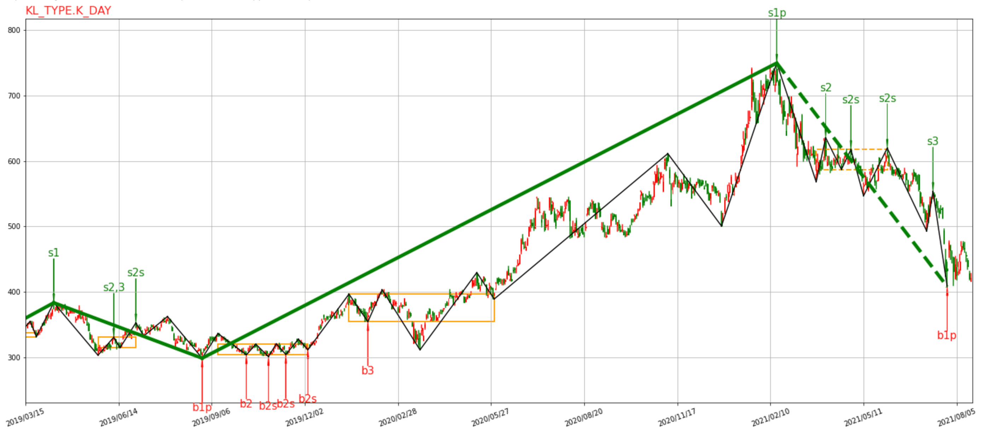
而下图则是由某简易策略计算出来的 cbsp，本框架中一般用虚线表示，如果前面有个 `√`，表示最后回过头来看，这个 cbsp 是找对了；

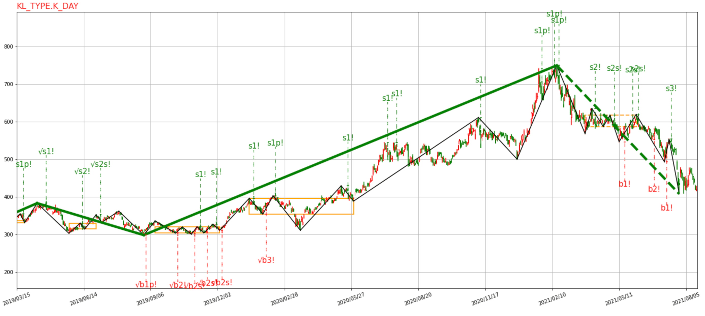

- segseg：字段命名为线段的线段，可以理解成把线段当成笔，算出其相应的线段结构；实际上可以当成父级别的线段；
- segbsp：即 segseg 对应的买卖点（形态学上的）；
- segzs：即 segseg 对应的中枢

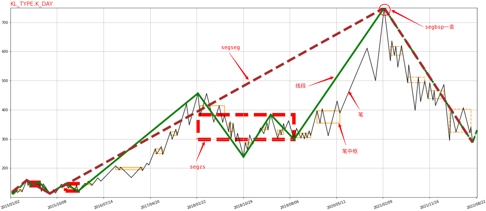

### 使用 demo
```python
from Chan import CChan
from ChanConfig import CChanConfig
from ChanModel.XGBModel import CXGBModel
from Common.CEnum import AUTYPE, KL_TYPE
from Config.EnvConfig import Env
from CustomBuySellPoint.CustomStrategy import CCustomStrategy
from Plot.AnimatePlotDriver import CAnimateDriver
from Plot.PlotDriver import CPlotDriver

config = CChanConfig({})  # 缠论计算配置，见后文

chan = CChan(
    code="HK.00700",
    begin_time="2012-01-01",
    end_time=None,
    data_src=DATA_SRC.FUTU,  # 数据来源,
    lv_list=[KL_TYPE.K_DAY],  # 多级别可以从大到小传入
    config=config,
    autype=AUTYPE.QFQ,
    extra_kl=None,
)

plot_config = {
    "plot_kline": True,
    "plot_kline_combine": True,
    "plot_bi": True,
    "plot_seg": True,
    "plot_eigen": False,
    "plot_zs": True,
    "plot_macd": False,
    "plot_mean": False,
    "plot_channel": False,
    "plot_bsp": True,
    "plot_cbsp": True,
    "plot_extrainfo": False,
}  # 绘图元素开关，详见后文

plot_para = {
    "seg": {
        "plot_trendline": True,  # 绘制趋势线
    },
    "bi": {
        "show_num": True,  # 笔是否显示序号
        "disp_end": True,  # 是否显示首尾价格
    },
    "figure": {
      "width": 24,
    },
    "cbsp": {
        "plot_cover": True,  # 绘制平仓操作
    },
}  # 空格绘图元素详细配置，详见后文

if not config.trigger_step:  # 绘制静态图
    plot_driver = CPlotDriver(
        chan,
        plot_config=plot_config,
        plot_para=plot_para,
    )
else:  # 绘制动画
    CAnimateDriver(
        chan,
        plot_config=plot_config,
        plot_para=plot_para,
    )
```

需要计算缠论相关数据，仅需 CChan 调用那一行；
如果需要画图:
- 单幅图使用 `CPlotDriver`
- 如果需要看回放动画，则使用 `CAnimateDriver`

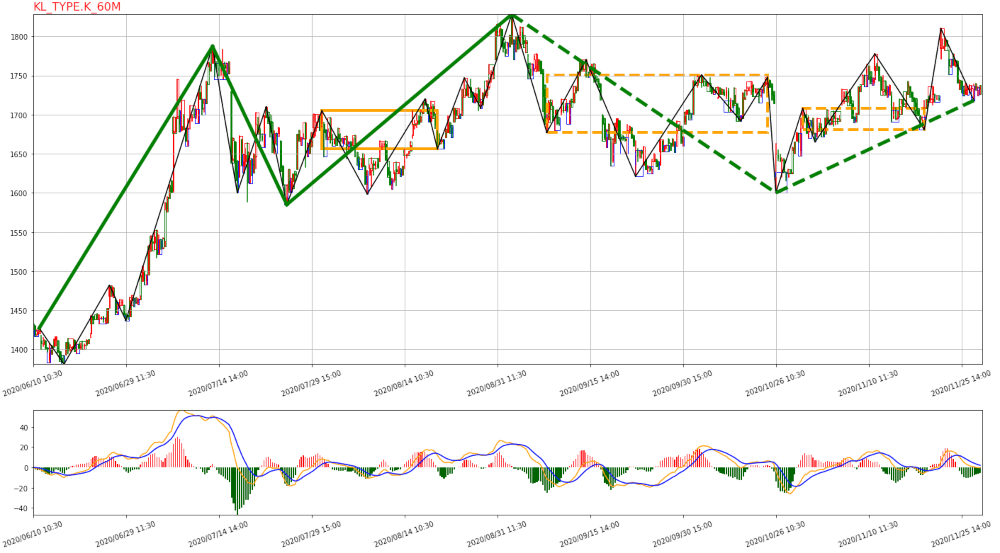

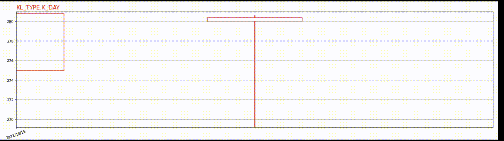

### CChan 类介绍
核心缠论信息计算类 CChan 接受参数包括：
- code：股票代码，具体格式取决于数据源格式
- begin_time：开始时间，默认为 None（至于 None 怎么理解,也取决于数据源格式）
- end_time：结束时间，默认为 None（至于 None 怎么理解,也取决于数据源格式）
- data_src：数据源，框架提供：
    - DATA_SRC.FUTU：富途
    - DATA_SRC.BAO_STOCK：BaoStock(默认)
    - DATA_SRC.CCXT：ccxt
    - DATA_SRC.CSV: csv（具体可以看内部实现）
    - "custom:文件名:类名"：自定义解析器
        - 框架默认提供一个 demo 为："custom: OfflineDataAPI.CStockFileReader"
        - 自己开发参考下文『自定义开发-数据接入』
- lv_list：K 线级别，必须从大到小，默认为 `[KL_TYPE.K_DAY, KL_TYPE.K_60M]`，可选：
    - KL_TYPE.K_YEAR（`-_-||` 没啥卵用，毕竟全部年线可能就只有一笔。。）
    - KL_TYPE.K_QUARTER（`-_-||` 季度线，同样没啥卵用）
    - KL_TYPE.K_MON
    - KL_TYPE.K_WEEK
    - KL_TYPE.K_DAY
    - KL_TYPE.K_60M
    - KL_TYPE.K_30M
    - KL_TYPE.K_15M
    - KL_TYPE.K_5M
    - KL_TYPE.K_3M
    - KL_TYPE.K_1M
- autype：复权类型，传递给获取数据接口，默认为 `AUTYPE.QFQ`,即前复权，可选
    - AUTYPE.QFQ
    - AUTYPE.HFQ
    - AUTYPE.NONE
- config：`CChanConfig` 类，缠论元素计算参数配置，参见下文 `CChanConfig`
- extra_kl：额外K线，常用于补充 `data_src` 的数据，比如离线 `data_src` 只有到昨天为止的数据，今天开仓需要加上今天实时获得的部分K线数据；默认为 None；
    - 如果是个列表：每个元素必须为描述 klu 的 `CKLine_Unit` 类；此时如果 `lv_list` 参数有多个级别，则会报错
    - 如果是个字典，key 是 `lv_list` 参数里面的每个级别，value 是数组，每个元素是 `CKLine_Unit` 类

>  如果需要部署成服务对外提供接口，调用 `CChan.toJson()` 可返回所有相关信息。

运行后，可通过 `CChan[KL_TYPE]` 的 bi_list，seg_list，bs_point_lst，cbsp_strategy 等属性获得笔，线段，bsp，cbsp 信息；

>  如果只有一个级别，可以省去 KL_TYPE，直接使用 `CChan[0].bi_list` 这种调用方法

### CChanConfig 配置
该参数主要用于配置计算逻辑，通过字典初始化 `CChanConfig` 即可，支持配置参数如下：
- 缠论计算相关：
    - 中枢
      - zs_combine：是否进行中枢合并，默认为 True
      - zs_combine_mode： 中枢合并模式，取值
          - zs：两中枢区间有重叠才合并（默认）
          - peak：两中枢有K线重叠就合并
      - one_bi_zs：是否需要计算只有一笔的中枢（分析趋势时会用到），默认为 False
      - zs_algo: 中枢算法normal/over_seg/auto（段内中枢/跨段中枢/自动，具体参见[中枢算法](#中枢算法)章节），默认为normal
    - 笔
      - bi_algo: 笔算法，默认为 normal
        - normal: 按缠论笔定义来算
        - fx: 顶底分形即成笔
      - bi_strict：是否只用严格笔(bi_algo=normal时有效)，默认为 Ture[中枢算法](#中枢算法)
      - gap_as_kl：缺口是否处理成一根K线，默认为 True
      - bi_end_is_peak: 笔的尾部是否是整笔中最低/最高, 默认为 True
      - bi_fx_check：检查笔顶底分形是否成立的方法
          - strict(默认)：底分型的最低点必须比顶分型3元素最低点的最小值还低，顶分型反之。
          - totally: 底分型3元素的最高点必须必顶分型三元素的最低点还低
          - loss：底分型的最低点比顶分型中间元素低点还低，顶分型反之。
          - half:对于上升笔，底分型的最低点比顶分型前两元素最低点还低，顶分型的最高点比底分型后两元素高点还高。下降笔反之。
      - bi_allow_sub_peak:是否允许次高点成笔，默认为True
    - 线段
      - seg_algo：线段计算方法
          - chan：利用特征序列来计算（默认）
          - 1+1：都业华版本 1+1 终结算法
          - break：线段破坏定义来计算线段
      - left_seg_method: 剩余那些不能归入确定线段的笔如何处理成段
          - all：收集至最后一个方向正确的笔，成为一段
          - peak：如果有个靠谱的新的极值，那么分成两段（默认）
    - mean_metrics：均线计算周期（用于生成特征及绘图时使用），默认为空[]
        - 例子：[5,20]
    - trend_metrics：计算上下轨道线周期，即 T 天内最高/低价格（用于生成特征及绘图时使用），默认为空[]
    - boll_n：布林线参数 N，整数，默认为 20（用于生成特征及绘图时使用）
    - macd: MACD配置
        - fast: 默认为12
        - slow: 默认为26
        - signal: 默认为9
    - cal_demark: 是否计算demark指标，默认为False
    - demark: 德马克指标配置
        - demark_len: setup完成时长度，默认为9
        - setup_bias: setup比较偏移量，默认为4
        - countdown_bias: countdown比较偏移量，默认为2
        - max_countdown: 最大countdown数，默认为13
        - tiaokong_st: 序列真实起始位置计算时，如果setup第一根跳空，是否需要取前一根收盘价，默认为True
        - setup_cmp2close: setup计算当前K线的收盘价对比的是`setup_bias`根K线前的close，如果不是，下跌setup对比的是low，上升对比的是close，默认为True
        - countdown_cmp2close：countdown计算当前K线的收盘价对比的是`countdown_bias`根K线前的close，如果不是，下跌setup对比的是low，上升对比的是close，默认为True
    - cal_rsi: 是否计算rsi指标，默认为False
    - rsi:
        - rsi_cycle: rsi计算周期，默认为14
    - cal_kdj: 是否计算kdj指标，默认为False
    - kdj:
        - kdj_cycle: kdj计算周期，默认为9
    - trigger_step：是否回放逐步返回，默认为 False
        - 用于逐步回放绘图时使用，此时 CChan 会变成一个生成器，每读取一根新K线就会计算一次当前所有指标，返回当前帧指标状况；常用于返回给 CAnimateDriver 绘图
    - skip_step：trigger_step 为 True 时有效，指定跳过前面几根K线，默认为 0；
    - kl_data_check：是否需要检验K线数据，检查项包括时间线是否有乱序，大小级别K线是否有缺失；默认为 True
    - max_kl_misalgin_cnt：在次级别找不到K线最大条数，默认为 2（次级别数据有缺失），`kl_data_check` 为 True 时生效
    - max_kl_inconsistent_cnt：天K线以下（包括）子级别和父级别日期不一致最大允许条数（往往是父级别数据有缺失），默认为 5，`kl_data_check` 为 True 时生效
    - print_warning：打印K线不一致的明细，默认为 True
    - print_err_time：计算发生错误时打印因为什么时间的K线数据导致的，默认为 False
    - auto_skip_illegal_sub_lv：如果获取次级别数据失败，自动删除该级别（比如指数数据一般不提供分钟线），默认为 False
- 模型：
    - model：模型类，支持接入机器学习模型对买卖点打分，参见下文「模型」，默认为 None
    - score_thred：模型开仓平仓分数阈值，`model` 配置时生效，默认为 None
    - cal_feature：是否计算特征，默认为 False（加速计算），但是如果开启了 `model` 或者 `cbsp_strategy` 会被强制设置成 True
- 离群点检测：（换手率，成交量等指标）
    - od_win_width：离群点检测窗口，默认为 100
    - od_mean_thred：离群点检测阈值，默认为 3.0
    - od_max_zero_cnt：指标为 0 的K线最大值，超过回抛异常，默认为 None，表示不检测
    - od_skip_zero：自动跳过指标为 0 的指标，（即不把 0 当做指标），默认为 True
- 买卖点相关：
    - divergence_rate：1类买卖点背驰比例，即离开中枢的笔的 MACD 指标相对于进入中枢的笔，默认为 0.9
    - min_zs_cnt：1类买卖点至少要经历几个中枢，默认为 1
    - bsp1_only_multibi_zs: `min_zs_cnt` 计算的中枢至少 3 笔（少于 3 笔是因为开启了 `one_bi_zs` 参数），默认为 True；
    - max_bs2_rate：2类买卖点那一笔回撤最大比例，默认为 0.9999
        - 注：如果是 1.0，那么相当于允许回测到1类买卖点的位置
    - bs1_peak：1类买卖点位置是否必须是整个中枢最低点，默认为 True
    - macd_algo：MACD指标算法（可自定义）
        - peak：红绿柱最高点（绝对值），默认【线段买卖点不支持】
        - full_area：整根笔对应的MACD的面积【线段买卖点不支持】
        - area：整根笔对应的MACD的面积（只考虑相应红绿柱）【线段买卖点不支持】
        - slope：笔斜率
        - amp：笔的涨跌幅
        - diff：首尾K线对应的MACD柱子高度的差值的绝对值
        - amount：笔上所有K线成交额总和
        - volumn：笔上所有K线成交量总和
        - amount_avg：笔上K线平均成交额
        - volumn_avg：笔上K线平均成交量
        - turnrate_avg：笔上K线平均换手率
        - rsi: 笔上RSI值极值
    - bs_type：关注的买卖点类型，逗号分隔，默认"1,1p,2,2s,3a,3b"
        - 1,2：分别表示1，2，3类买卖点
        - 2s：类二买卖点
        - 1p：盘整背驰1类买卖点
        - 3a：中枢出现在1类后面的3类买卖点（3-after）
        - 3b：中枢出现在1类前面的3类买卖点（3-before）
    - "bsp2_follow_1"：2类买卖点是否必须跟在1类买卖点后面（用于小转大时1类买卖点因为背驰度不足没生成），默认为 True
    - "bsp3_follow_1"：3类买卖点是否必须跟在1类买卖点后面（用于小转大时1类买卖点因为背驰度不足没生成），默认为 True
    - "bsp3_peak"：3类买卖点突破笔是不是必须突破中枢里面最高/最低的，默认为 False
    - "bsp3a_max_zs_cnt": 3类买卖点最多可以跨越多少个中枢，默认为1
    - "bsp2s_follow_2": 类2买卖点是否必须跟在2类买卖点后面（2类买卖点可能由于不满足 `max_bs2_rate` 最大回测比例条件没生成），默认为 False
    - "max_bsp2s_lv": 类2买卖点最大层级（距离2类买卖点的笔的距离/2），默认为None，不做限制
    - "strict_bsp3":3类买卖点对应的中枢必须紧挨着1类买卖点，默认为 False
- 自定义策略类相关（关于策略类详细介绍参见后文）：
    - cbsp_strategy：自定义策略类，默认为 None
        - 框架自带实现类别为 `CCustomStrategy`/`CSegBspStrategy`
    - strategy_para：需要传递给自定义买卖点的参数，字典，默认为{}
        - 如果使用的是自带类 `CCustomStrategy`/`CSegBspStrategy`，支持配置参数包括：
            - strict_open：严格开仓条件，即如果对一个买卖点当下无法找到合适的买卖时机却已经完成一笔了，就放弃。默认为 True。
            - use_qjt：使用区间套计算买卖点（多级别下才有效），默认为 True。
            - short_shelling：是否做空，默认为 True
            - judge_on_close：根据K线收盘价来作为开/平仓指标，默认为 True（否则当天K线某一时刻突破了信号阈值即会交易）
            - max_sl_rate：最大止损阈值（如果策略计算出来的止损阈值超过此值，会被截断），默认为 None
            - max_profit_rate：最大止盈阈值（比如买点买了，卖点还没出现但收益已经超过该值），默认为 None
    - only_judge_last：只计算最后一跟K线的买卖点类型/买卖点信号，默认为 False。
        - 开启后速度非常快，适合用于海量选股时使用，或者每天计算出现交易信号的股票时使用
    - cal_cover：是否计算平仓，默认为 True；（对做空同样生效）
    - cbsp_check_active：cbsp 开仓是否需要满足交易活跃度指标，默认为 True，既不交易不活跃股票
    - print_inactive_reason：是否打印股票不活跃原因，默认为 False
    - stock_no_active_day: 不活跃股票计算检测最近多少根K线，默认为 30
    - stock_no_active_thred：`stock_no_active_day` 根K线内一字线超过阈值则定义为不活跃；（涨跌停除外），默认为 3
    - stock_distinct_price_thred: `stock_no_active_day` 根K线内股价多样性低于多少则定义为不活跃，默认为 25

#### 精确设置配置
`divergence_rate`,`min_zs_cnt`,`bsp1_only_multibi_zs`,`max_bs2_rate`,`macd_algo`,`bs1_peak`,`strategy_para`，`bs_type`，`bsp2_follow_1`，`bsp3_follow_1`，`bsp2s_follow_2`，`strict_bsp3`，`score_thred`，`bsp3_peak` 这几个指标可以分别对买卖点/线段买卖点各自设置：

- 后面加 `-buy` 或 `-sell`，比如 min_zs_cnt-buy=2，min_zs_cnt-sell=1：对『笔』的买点/卖点生效
- 后面加 `-segbuy` 或 `-segsell`：对『线段』的买点/卖点生效
- 后面加 `-seg`：对『线段』的买卖点同时生效
- 后面啥也没加：对『笔』『线段』的买卖点同时生效

#### CChanConfig 配置 Demo
```python
config = CChanConfig({
    "zs_combine": True,
    "zs_combine_mode": "zs",
    "bi_strict": True,
    "mean_metrics": [],
    "trigger_step": False,
    "skip_step": 0,
    "seg_algo": "chan",
    "divergence_rate": 0.9,
    "min_zs_cnt": 1,
    "max_bs2_rate": 0.618,
    "bs1_peak": True,
    "macd_algo": "peak",
    "bs_type": '1,2,3a,3b,2s,1p',
    "cbsp_strategy": CCustomStrategy,
    "only_judge_last": False,
    "strategy_para": {
        "strict_open": True,
        "use_qjt": True,
        "short_shelling": True,
    }
})
```

### 画图配置
#### plot_config
CPlotDriver 和 CAnimateDriver 参数，用于控制绘制哪些元素

- plot_kline：画K线，默认为 False
- plot_kline_combine：画合并K线，默认为 False
- plot_bi：画笔，默认为 False
- plot_seg：画线段，默认为 False
- plot_eigen：画特征序列（一般调试用），默认为 False
- plot_zs：画中枢，默认为 False
- plot_segseg：画线段分段，默认为 False
- plot_segeigen：画线段分段的特征序列（一般调试用），默认为 False
- plot_bsp：画理论买卖点，默认为 False
- plot_cbsp：画自定义策略买卖点位置，默认为 False
- plot_segzs：画线段中枢，默认为 False
- plot_segbsp：画线段的理论买卖点，默认为 False
- plot_macd：画 MACD 图（图片下方额外开一幅图），默认为 False
- plot_channel：画上下轨道，默认为 False
- plot_boll：画布林线，默认为 False
- plot_mean：画均线，默认为 False
- plot_tradeinfo：绘制配置的额外信息（在另一根 y 轴上），默认为 False
- plot_marker: 添加自定义文本标记
- plot_demark: 绘制Demark指标
- plot_rsi: 绘制rsi指标
- plot_kdj: 绘制kdj指标

其中这个参数有几种写法：
- 字典：比如`{"plot_bi": True, "plot_seg": True}`
- 数组：比如`["plot_bi", "plot_seg"]`，即出现在数组中的为Tue
- 字符串：比如`"plot_bi,plot_seg"`
- 分级别填写：比如绘制两个级别日线和30分钟线，那么可以`{KL_TYPE.K_DAY: ${CONFIG}, KL_TYPE.K_30M: ${CONFIG}}`，其中`${CONFIG}`为上面三种写法之一；

> 另外，前缀`plot_`是可以不填的

#### plot_para
用于具体画图细节控制，具有两级，每个配置都有二级参数，传入一个二级字典实现修改需要更改的参数；

- figure：图相关
    - w: 20  宽度
    - h:10  高度
    - macd_h: 0.3  MACD 图高度相对于 h 的比例
    - only_top_lv: False  是否只画最高级别
    - x_range:0  最高级别绘制只画最后几根K线范围，为 0 表示不生效，绘制全部
    - x_bi_cnt:0  最高级别绘制只画最后几笔范围，为 0 表示不生效，绘制全部
    - x_seg_cnt:0  最高级别绘制只画最后几根线段范围，为 0 表示不生效，绘制全部
    - x_begin_date:'0' 最高级别绘制只画最后从指定日期开始的范围, 格式为`YYYY/MM/DD`，为 '0' 表示不生效，绘制全部
    - x_end_date:'0' 最高级别绘制只画最后到指定日期结束的范围, 格式为`YYYY/MM/DD`，为 '0' 表示不生效，绘制全部
    - x_tick_num: 10 横坐标有多少个tick显示日期
    - grid：xy  绘制网格，x/y/xy/None 分别是只画横轴，纵轴，都画，不画

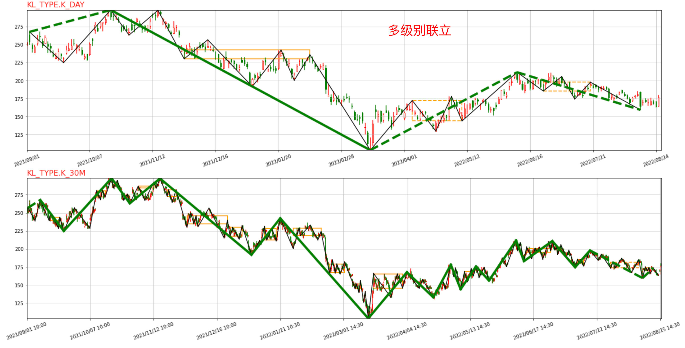

- kl: k 线相关
    - width: 0.4  宽度
    - rugd: True  红涨绿跌
    - plot_mode: 'kl'  绘制模式，kl 表示绘制K线，close/open/high/low 会将相应的数据连成线
- klc: 合并K线相关
    - width: 0.4  宽度
    - plot_single_kl: True  合并K线只包含一根 k 线是否需要画框

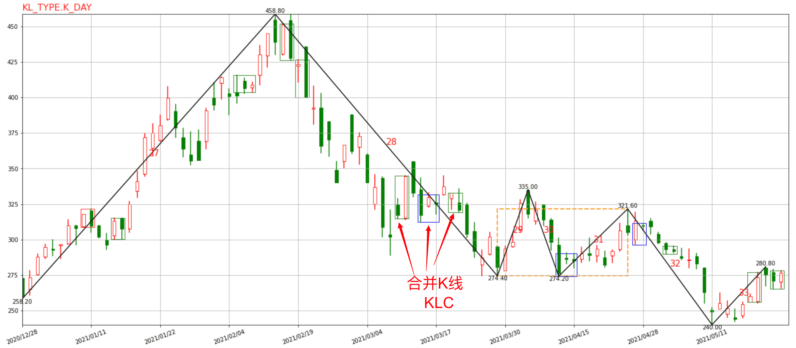

- bi：笔(虚线表示还没确定的笔)
    - color: 'black'  笔颜色
    - show_num: False  笔中间标上序号
    - num_color: 'red'  序号颜色
    - num_fontsize: 15  序号字体大小
    - sub_lv_cnt: None  次级别只画本级别的多少笔，None 即为全部；参考下图，sub_lv_cnt=6，即次级别绘制范围是本级别最后 6 笔；【注意：不可和 seg 的 sub_lv_cnt 同时设置】
    - facecolor: 'green'  如果 sub_lv_cnt 非空，那么本级别需要标示出次级别对应的本级别范围，该范围颜色为 facecolor
    - alpha: 0.1  facecolor 的透明度
    - disp_end: False  是否显示尾部数值（第一笔也会显示头部数值）
    - end_color: 'black'  尾部数值颜色
    - end_fontsize: 10  尾部数值字体大小
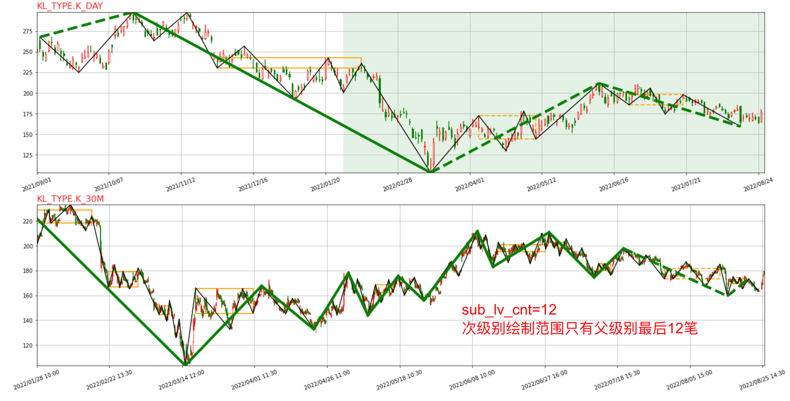

- seg:  线段(虚线表示还没确定的笔)
    - width: 5  线段线宽度
    - color: 'g'  线段颜色
    - sub_lv_cnt: None  次级别只画本级别的多少线段，默认为 None 即全部；【注意：不可和 bi 的 sub_lv_cnt 同时设置】
    - facecolor: 'green'  如果 sub_lv_cnt 非空，那么本级别需要标示出次级别对应的本级别范围，该范围颜色为 facecolor
    - alpha: 0.1  facecolor 的透明度
    - disp_end: False  是否显示尾部数值
    - end_color: 'g'  尾部数值颜色
    - end_fontsize: 13  尾部数值字体大小
    - plot_trendline: False  绘制趋势线
    - trendline_color: 'r'  趋势线颜色
    - trendline_width: 3  # 趋势线宽度
    - show_num: False  线段中间标上序号
    - num_color: 'blue'  序号颜色
    - num_fontsize: 30  序号字体大小

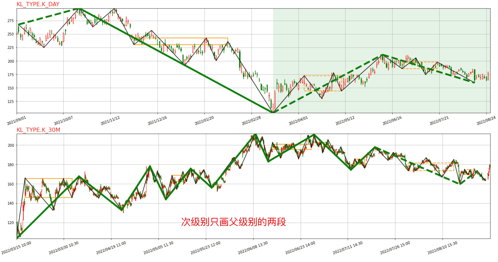
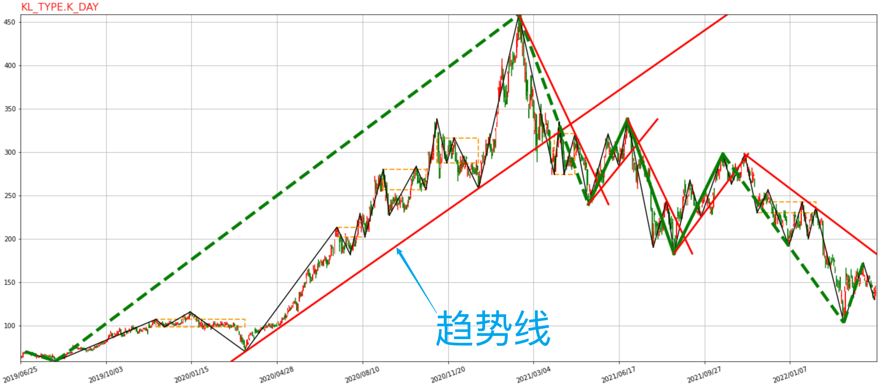

- zs:  中枢
    - color: 'orange'  颜色
    - linewidth: 2  线宽
    - sub_linewidth: 0.5  子中枢线宽
    - show_text: False  显示中枢高低点数值
    - fontsize: 14  高点点数值字体大小
    - text_color: 'orange'  高低点数值颜色
    - draw_one_bi_zs: False  绘制只有 1 笔的中枢

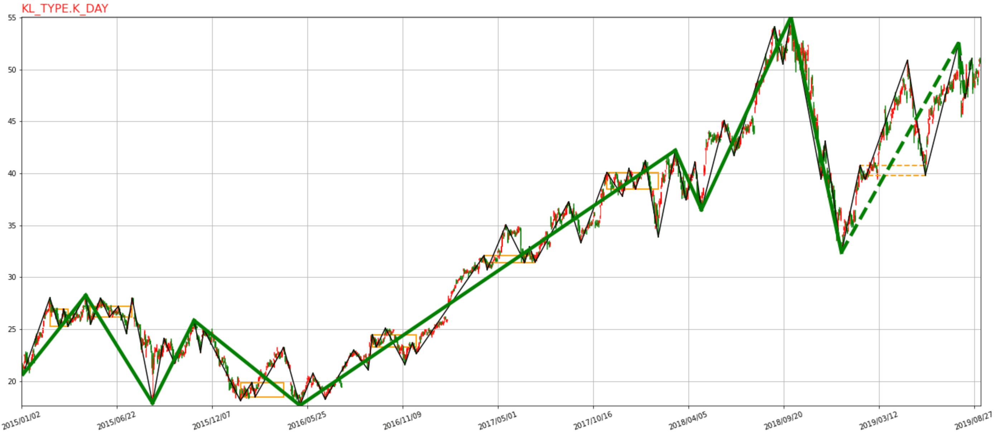

- eigen/segeigen:  特征序列（`CChanConfig` 中 `seg_algo` 设置为 `chan` 时有效）
    - color_top: 'r'  顶分型颜色
    - color_bottom: 'b'  底分型颜色
    - aplha: 0.5  透明度
    - only_peak: False  只画顶底分型第二元素

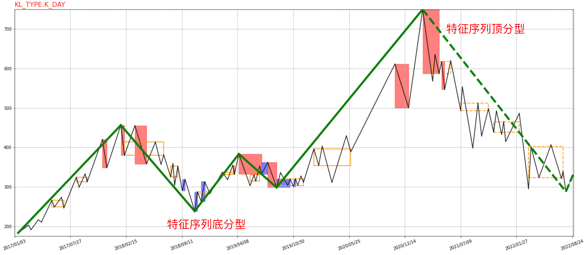

- bsp:  形态学买卖点，实线表示，
    - buy_color: 'r'  买点颜色
    - sell_color: 'g'  卖点颜色
    - fontsize: 15  字体大小
    - arrow_l: 0.15  箭头占图总高度(即 figure_h)比例
    - arrow_h: 0.2  箭头头部占箭头长度比例
    - arrow_w: 1  箭头宽度
- cbsp:  动力学买卖点，虚线表示，往往会落后于 bsp 的出现
    - buy_color: 'r'  买点颜色
    - sell_color: 'g'  卖点颜色
    - fontsize: 15  字体大小
    - arrow_l: 0.3  箭头占图总高度(即 figure_h)比例
    - arrow_h: 0.1  箭头头部占箭头长度比例
    - arrow_w: 1  箭头宽度
    - plot_cover: True  绘制策略平仓的点
    - adjust_text: False  cbsp 描述文本是否需要自动调整位置防止重叠，默认为 False（配置后将不会重新拉伸纵轴，可能出现文本被挤到绘图框外的情况，如果 cbsp 数量不多，建议配置）
    - only_segbsp: False  只标示出来同时是线段买卖点的 cbsp
    - show_profit: True  显示收益率（需要开启 `CChanConfig` 中 `cal_cover`）

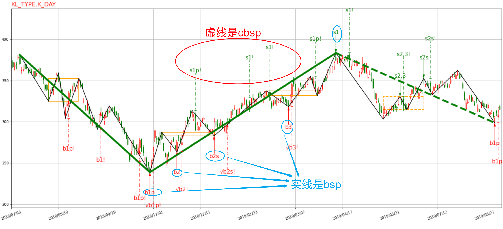

- segseg:  线段的线段
    - width: 7  宽度
    - color: 'brown'  颜色
    - disp_end: False  是否显示尾部数值
    - end_color: 'brown'  尾部数值颜色
    - end_fontsize: 15  尾部数值字体大小
- segzs:  线段中枢
    - color: 'red'  颜色
    - linewidth: 10  线宽
    - sub_linewidth: 4  子中枢宽度（在开启中枢合并情况下）
- seg_bsp:  线段买卖点（有※标示）
    - buy_color: 'r'  买点颜色
    - sell_color: 'g'  卖点颜色
    - fontsize: 18  字体大小
    - arrow_l: 0.2  箭头占图总高度(即 figure_h)比例
    - arrow_h: 0.25  箭头头部占箭头长度比例
    - arrow_w: 1.2  箭头宽度


- boll:  布林线（必须先配置 `boll_n`）
    - mid_color: 'black'  中轨线颜色
    - up_color: 'blue'  上轨线颜色
    - down_color: 'purple'  下轨线颜色

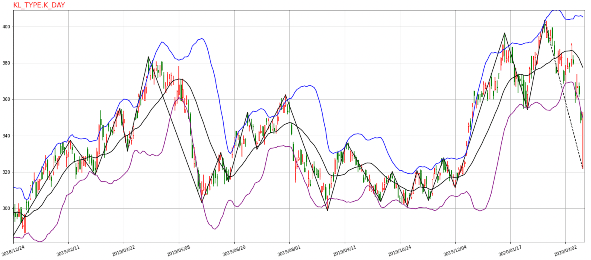

- channel:  上下轨道
    - T: None  T 天内的上下轨道，必须在 `CChanConfig.trend_metrics` 中出现，如果为 None，则为 `CChanConfig.trend_metrics` 的最大值
    - top_color: 'r'  上轨道颜色
    - bottom_color: 'b'  下轨道颜色
    - linewidth: 3  轨道线宽度
    - linestyle: 'solid'  轨道线类型

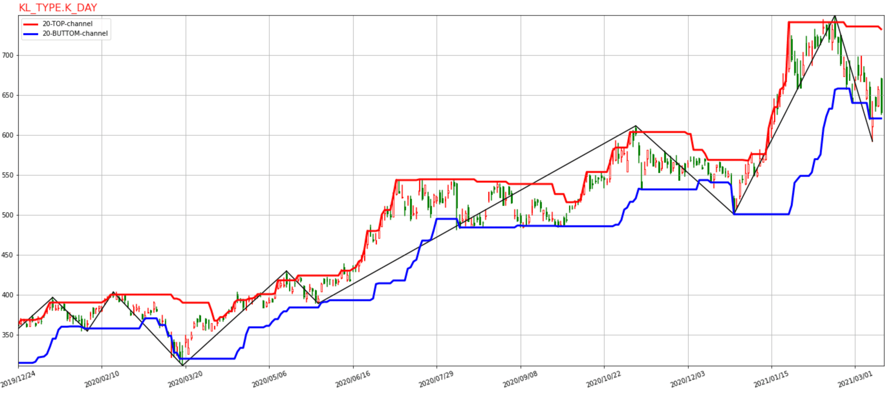

- mean：均线，无可配置参数

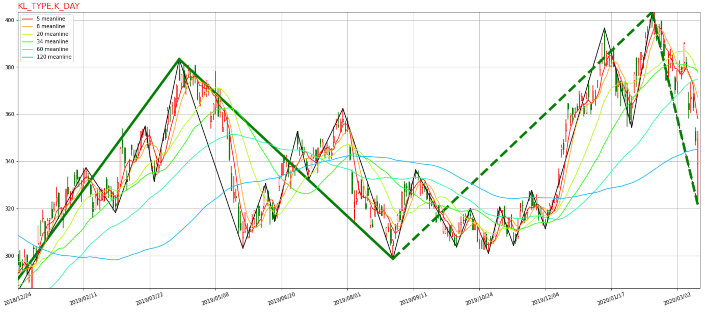

- macd:
    - width: 0.4  红绿柱宽度

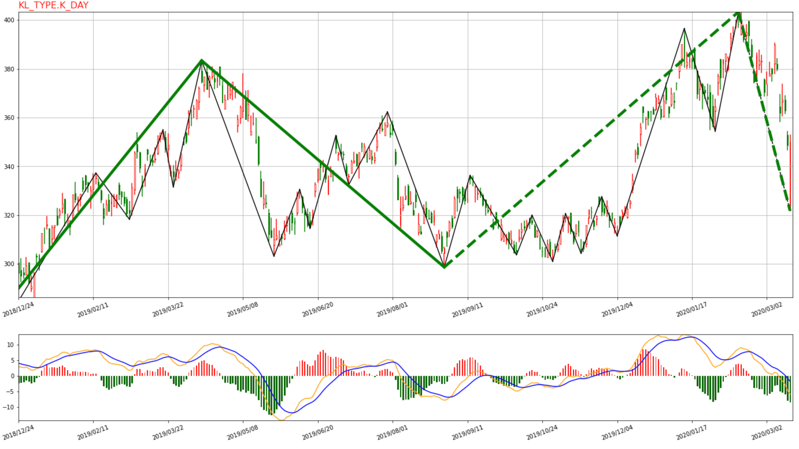

- tradeinfo: K线指标
    - plot_curve: True  绘制指标
    - info: 'volume'  绘制内容，可选值包括
        - volume：成交量（默认）
        - turnover：成交额
        - turnover_rate：换手率
    - plot_outliner: True  绘制离群点
    - color: 'b'  颜色
    - outline_color: 'orange'  离群点颜色
    - thred: 2.0  离群点阈值
    - plot_mean: False  绘制离群点算法中的均值线
    - meanline_color: 'r'  离群算法均线颜色
    - plot_od_score: False  绘制离群值
    - od_score_color: 'k'  离群值颜色

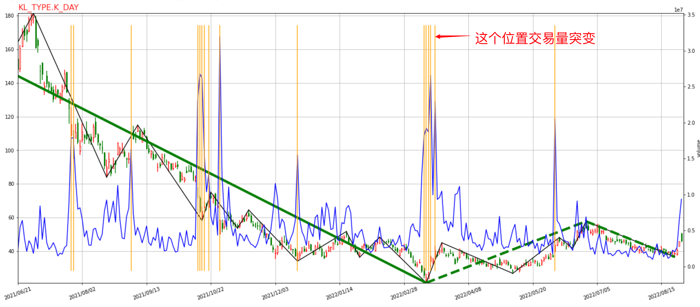

- marker: 在指定日期K线上自定义文本标记
    - markers: 文本描述，字典
        - 键：CTime类或者YYYY/MM/DD字符串
        - 值：元组，两种写法：
            - (text, up/down, color)
            - (text, up/down)：颜色为下面配置的`default_color`
    - arrow_l: 箭头长度占y轴范围比例，默认为0.15
    - arrow_h: 箭头头部长度，默认0.2
    - arrow_w: 箭头头部宽度，默认1
    - fontsize: 字体，默认14
    - default_color: 默认颜色，默认为'b'


- demark: 德马克/demark指标
    - setup_color: setup序号颜色，默认为'b'
    - countdown_color: countdown序号颜色，默认为'r'
    - fontsize: 序号字体大小，默认为12
    - min_setup: 序列最小setup(完成的序列setup最大值小于该值的不会在图上显示)，默认为9
    - max_countdown_background：countdown阶段，且达到最大countdown（即默认的13）的序号突出显示的背景颜色，默认为'yellow'
    - begin_line_color: setup真实起始位置线颜色，默认为'purple'
    - begin_line_style: setup真实起始位置线类型，默认为虚线'dashed'

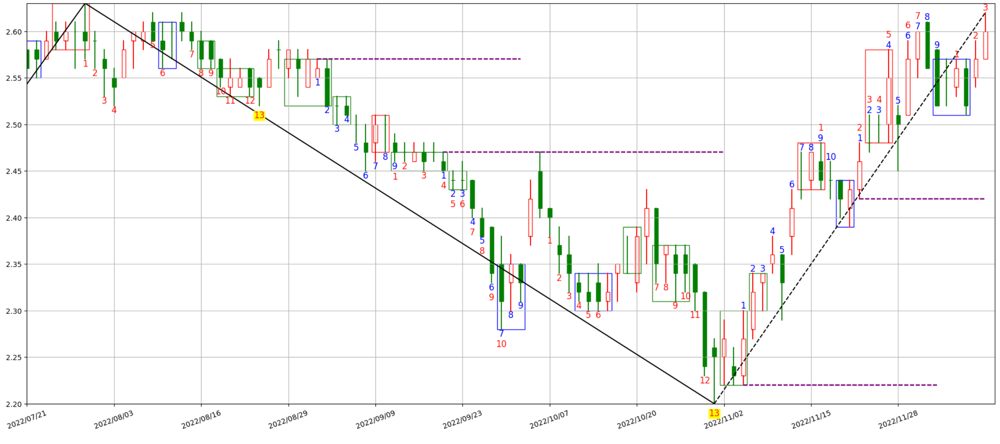

- rsi: RSI指标
    - color: 颜色，默认为b

- kdj: KDJ指标
    - k_color: K指标颜色，默认为orange
    - d_color: D指标颜色，默认为blue
    - j_color: J指标颜色，默认为pink


### 中枢算法
中枢算法主要有`zs_algo`参数决定，有两种取值：
- normal: 段内中枢
- over_seg: 跨段中枢
- auto: 对于确定的线段，采用normal算法，不确定部分用over_seg

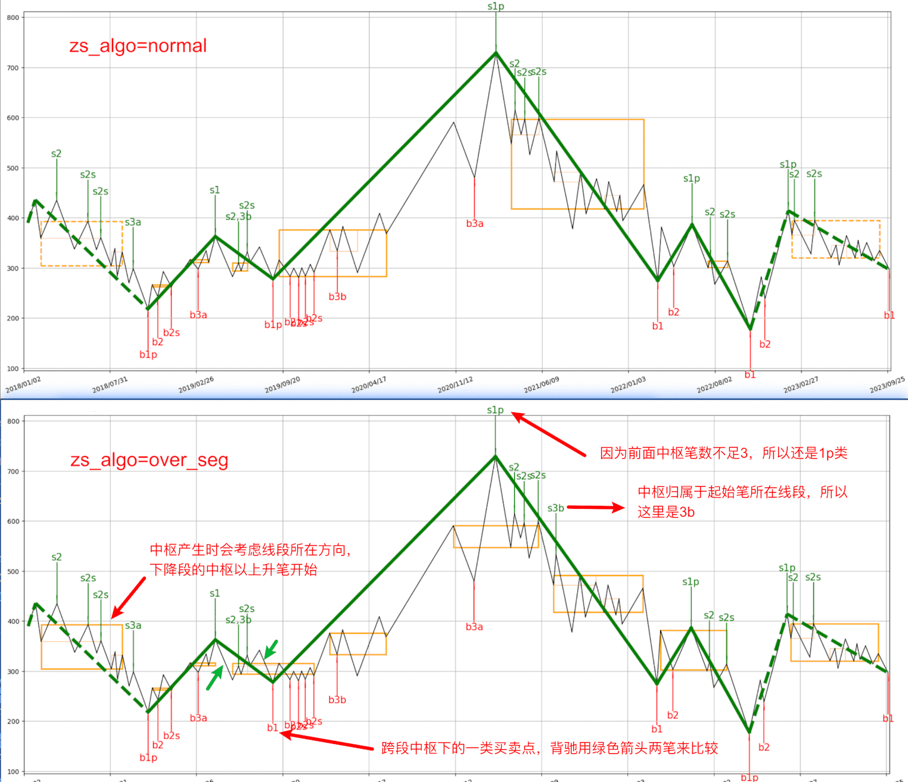

#### 段内中枢
中枢满足：
- 上升线段起始笔为下上下，下降线段起始笔为上下上
- 中枢一定是奇数笔
- 中枢不跨段（即便后一段为虚段）


#### 跨段中枢
中枢满足：
- 当一个新的中枢产生时，起始笔会考虑线段方向，上升线段起始笔为下上下，下降线段起始笔为下上下
  - 说明中枢也有所属线段的，属于第一笔所在的线段
- 中枢延伸时，当前笔和下一笔的高点范围均与中枢的高低范围有交集，那么当前笔就会纳入该中枢
- 中枢的笔数可能为奇数，也可能为偶数，取决于什么时候有一笔离开中枢
- 中枢可能跨段
- 相邻中枢如果分别属于两个段，不会进行合并（因为这种模式下可能会出现合并出一个巨大的中枢，使得后续所有笔都在这个中枢里面）
- 如果一类买卖点在跨段中枢的中间，背驰判断如上图所示。


## 模型
本框架可以通过机器学习方法来提高买卖点判断的准确率，在计算动力学买卖点 cbsp 时，会同时计算默认提供的数百个特征（一直持续增加中）和五种不同的标签；

可以通过运行 `ModelStrategy/backtest.py` 特征回测脚本，计算所有感兴趣的股票的特征和 label，并落地为本地文件；

然后开发一个类继承自 `ModelStrategy/ModelGenerator.py`(详情见下文『模型开发』)，训练出模型文件，并评估离线指标；

【可选】有了模型，什么阈值买点收益更高，模型对哪一类买卖点效果更好，买卖点具备什么属性更适合这个模型；我们可以将模型类注册进 `ModelStrategy/parameterEvaluate/para_automl.py` 的 AUTOML 框架中，通过对每种参数评估出盈亏比，交易次数，最大回撤，平均收益等诸多指标，然后自己实现一个 `CalScore(eval_res)` 函数，计算出该策略的分值；automl 框架会自动启发式的搜索出最优参数组合；（这个可能需要专门写一篇长文来解释。。。）

有了模型，参考下文『模型接入』实现一个类继承自 `CCommModel`，并设置为配置 `CChanConfig.model`，即可实现对每个 cbsp 进行打分；

【可选】如果担心接入后线上模型和离线模型特征不一致带来的差异（比如 backtest.py 中笔段的计算起始时间和实盘中的不一样，可能会导致某些特征不相等），可以运行 `ModelStrategy/FeatureReconciliation.py` 来进行特征一致性检查；

同时，如果为了例行更新模型，可以配置后直接运行 `Script/run_train_pipeline.sh`，会自动完成以下所有流程：
- 回测
- 模型训练
- 预测数据
- Automl 计算
- 解析 automl 结果生成到 `Trade/Script/OpenConfig.yaml`

## 特征
本框架中所有的特征计算均在 `ChanModel/Features.py` 中实现，而特征的描述 meta 均注册在 `ChanModel/FeaturesDesc.py`（运行完回测脚本 `backtest.py` 后运行 `FeaturesDesc.py` 即可获得那些特征描述还没注册）；

特征最终是为了描述 cbsp 而设计的，而 cbsp 生成过程中一定对应某个 bsp，bsp 计算过程中也会产生描述 bsp 的特征，这些特征会被同步附加到 cbsp 的特征列表里面；如果要获取某级别某个特征的值，可以通过 `CChan[lv].cbsp_strategy.features[feat_name]` 获得；

`CFeatures` 通过回测脚本 `backtest.py` 可以生成特征文件供模型训练研究用；也可以对接到 `CCommModel` 类，在实盘中对 cbsp 打分；

### 默认特征情况
框架默认提供 400+特征：

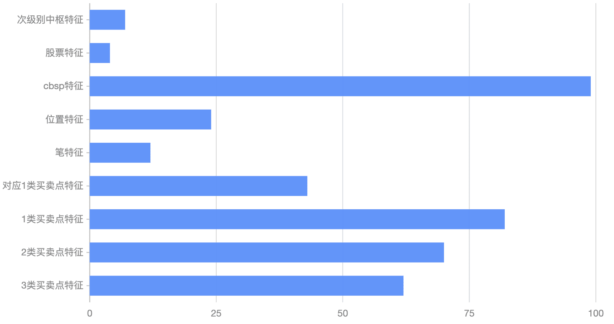

## 交易系统
本框架暂时只实现了对接 futu 交易系统；原因也比较简单，接入门槛低，而且提供非常完善的 API，可以一键切换模拟盘 & 实盘；

其中交易系统包含的主要模块为：
- 后端数据库
- 信号计算
- 交易引擎

### 交易后端数据库
数据库支持 sqlite 和 Mysql 两种，可以在安装时在配置文件 config.yaml 中指定；

数据库结构为（以 mysql 为例）：
```sql
create table if not exists {table_name}(
    id int(11) NOT NULL AUTO_INCREMENT,
    add_date datetime(6),  --- 计算信号时
    stock_code varchar(20) NOT NULL,  --- 计算信号时
    stock_name varchar(64) NOT NULL,  --- 计算信号时
    status varchar(20) NOT NULL,
    lv char(5) NOT NULL,  --- 计算信号时
    bstype char(10) NOT NULL,  --- 计算信号时
    is_buy boolean default true,  --- 计算信号时
    open_thred float,  --- 计算信号时
    sl_thred float,  --- 计算信号时
    target_klu_time varchar(10),  --- 计算信号时

    watching boolean default true,  --- 默认为True, 信号不再生效时/修复错误信号时为False
    unwatch_reason varchar(256),  --- 计算信号时不再生效时设置
    signal_last_modify datetime(6),  --- 计算信号时不再生效时设置
    model_version varchar(256), --- 开仓时
    model_score_before float,  --- 开仓时
    snapshot_before varchar(256),  --- 开仓时
    model_score_after float,  --- 分数复查时
    snapshot_after varchar(256),  --- 分数复查时

    is_open  BOOLEAN default false,  --- 开仓信号突破时
    open_price float,  --- 成交时设置
    quota int default 0,  --- 提交订单时
    open_date datetime(6),  --- 开仓信号突破时
    open_order_id varchar(32),  --- 提交订单时
    open_image_url varchar(64),--- 开仓信号突破时
    cover_image_url varchar(64),--- 平仓时
    peak_price_after_open float, --- 更新peak_price时

    cover_avg_price float, -- 平仓成交时
    cover_quota int default 0, --- 平仓提交订单时
    cover_date datetime(6), --- 平仓提交订单时
    cover_reason varchar(256),  ---  or 平仓提交时设置
    cover_order_id varchar(256), --- 平仓提交订单时

    open_err boolean default false,  --- 默认为FALSE, recheck时发现错误信号设置为True
    close_err boolean default false,
    open_err_reason varchar(256),  --- recheck时发现错误信号设置为True
    close_err_reason varchar(256),

    relate_cover_id int, --- 平仓信号突破时设置
    is_cover_record bool default false, --- 开仓时设置
    PRIMARY KEY (id)
    );
```

字段主要描述了一个信号从产生，到开仓，最后到因为种种原因平仓的环境记录；

另外，在 `db_util.py` 中已经实现了 `CChanDB()`，根据缠论的不同操作（开仓，平仓，止损，获取信号灯）对数据库增删改查封装了函数接口，可以在外部或者交易引擎中直接使用，而无需关注实现细节；

直接使用 `db = CChanDB()` 即可，无需初始化，会自动从配置文件中读取数据库类型和连接参数；

### 信号计算
信号计算的实现在 `SignalMonitor.py` 中实现，按照下文『cbsp 买卖点策略』中需要实现一个类继承自 CStrategy，并且实现产生信号数据的接口 `bsp_signal`，那么因为配置文件中设置了该 `cbsp_strategy`，所以可以不用做修改每周期例行化运行，即可实现：
- 信号计算
- 信号入库
- 删除不再生效的信号
- 上报信号指标（新增多少信号，删除多少信号灯），推送结果

### 交易引擎
交易引擎类实现在 `TradeEngine.py` 中，初始化方法为：`CTradeEngine(market: TrdMarket, chan_db: CChanDB)`

该引擎实现了：
- 交易接口调用频率控制
- 自动判断当天是否是交易日或者只有半天是交易日，只在交易时间操作，见 `CTradeEngine.wait4MarketOpen()`
- 现场恢复：如果程序因为种种原因挂了，重启后自动恢复已提交订单的现场，保证不会重复提交开仓
- 开仓：`add_trade(trade_info: CTradeInfo, price)`，传入信号和开仓价格
- 仓位控制：需要用户继承自 `COpenQuotaGen` 实现一个仓位控制类，输入当前价格和一手多少股，返回需要开仓多少手
- 提交平仓单：会根据订单不同结果同步更改数据库中对应的开仓数据
- 订单微调：如果当前价格无法成交，支持自动调整价格
- 轮询状态：支持配置
    - 轮询次数
    - 轮询间隔
    - 是否需要微调未成交订单
    - 是否实时推送成交订单，未成交订单状态
- 各种关键信息的推送

### 典型流程
一个典型的交易流程（即本框架 `Trade/Script` 下实现的）包括以下步骤：
- 更新离线所有关注股票数据（借助 `DataAPI/OfflineDataAPI.py` 而不是网络接口，可以提高线上交易处理速度）
- 计算信号
- 检测信号是否突破
    - 如果突破：检测模型分数（如果配置了模型类的话）是否高于指定阈值，是则开仓
- 对于开仓结果进行后验：比如对于天级别的交易，交易时当天K线肯定还没完成，所以需要在K线完成后重新检查是否突破和分数阈值
    - 如果后验校验没问题：持续更新股价，是否触达止损，止盈或者平仓买卖点产生
    - 如果后验有问题：下一个周期马上以最快的速度卖出，无论是否盈利

## 自定义开发
### 数据接入
加入自己本地数据源或增加对其他网络数据源的解析，可以参考 `DataAPI/*API.py` 文件，默认提供了读取 akshare，baostock，etf 指数数据，futu 和本地离线文件的 demo；

方法是实现一个类，继承自 `CCommonStockApi`，接受输入参数为 code, k_type, begin_date, end_date；
并在该类里面实现两个方法：

1. `get_kl_data(self)`：该方法为一个生成器，yield 返回每一根K线信息 `CKLine_Unit(idx, k_type, item_dict)`，其中 item 为：
```
{
    DATA_FIELD.FIELD_TIME: time,  # 必须是框架实现的CTime类
    DATA_FIELD.FIELD_OPEN: float(_open),
    DATA_FIELD.FIELD_CLOSE: float(_close),
    DATA_FIELD.FIELD_LOW: float(_low),
    DATA_FIELD.FIELD_HIGH: float(_high),
    DATA_FIELD.FIELD_VOLUME: float(volume),
    DATA_FIELD.FIELD_TURNOVER: float(amount),
    DATA_FIELD.FIELD_TURNRATE: float(turn),
}
```

2. `SetBasciInfo()`：用于设置股票名字和其他需要用到的信息

### 实时数据接入
当使用本框架用于实盘交易时，往往需要使用实时的K线数据，本框架已经实现了 akshare，futu，sina，pytdx 等几种实时数据类；如果要实现其他实时数据接入，仅需参考 `DataAPI/SnapshotAPI/` 目录下相应脚本的实现即可；

方法是实现一个类，包含一个query的**类方法**：
- 输入为：
  - `code_list`: List[str],代码列表
  - `return_klu`: bool，是否返回K线类
- 返回值
  - 一个字典，其中key就是输入`code_list`里面的各个code，各个value分别为：
    - 如果return_klu==True，返回`CKLine_Unit`类
    - 如果return_klu==False，返回字典`Dict[str, float]`，为是包含 name,price,low,high,open,yesterdayClose 五个 key 的字典，其中price,low,high必须有，其他选填
  - 如果获取失败，对应股票的键值返回None

```python
class CCustomSnapshot:
    @classmethod
    def query(cls, code_list: List[str], return_klu: bool) -> Dict[str, Optional[CKLine_Unit | Dict[str, float]]]:
        ...
```

然后再在`DataAPI/SnapshotAPI/StockSnapshotAPI.py`的`priceQuery`注册:

```python
def priceQuery(codelist: List[str], engine: str, return_klu: bool = False):
    _class_dict = {
        'sina': CSinaApi,
        'futu': CFutuSnapshot,
        'pytdx': CPytdxSnapshot,
        'ak': CAKShareSnapshot,
    }
    if engine in _class_dict:
        return _class_dict[engine].query(codelist, return_klu=return_klu)
    else:
        raise Exception(f"eigen={engine} not found")
```

最后在`config.yaml`中配置修改`snapshot_engine`信息即可；


### 笔模型
笔模型由于比较简单，如果要增加自己的逻辑，建议在读懂代码情况下直接修改 `Bi/BiList.py` 和 `Bi/Bi.py` 即可；

后续可能会考虑将完全自由的开发类的方法开放出来；

### 线段模型
线段的计算坊间也有多种不同的计算方法，框架提供基于特征序列，基于笔破坏，都业华课程中所谓的 1+1 终结等几个实现；

如需实现自己的算法，实现一个类，继承自 `CSegListComm`，实现一个函数 `update(self, bi_list: CBiList)` 即可，bi_list 包含了所有已知笔的信息；

其中 `CSegListComm` 有两个属性：
- `CSegListComm.lst: List[CSeg]` 存储所有计算出来的线段，必须按顺序存储；
- `CSegListComm.config: CSegConfig` 线段配置类，如果需要传入自己实现的配置参数，可通过这个类实现

> 必须要说明一下的是，`CSegListComm` 提供了大量对还没确定K线计算虚线段的通用处理函数，这不仅是整个项目里面逻辑最复杂最难的部分，也是代码最难以维护的部分。。之前这个文件代码撸了好几天，里面加了大量的检测断言，验收标准是对全量 A股港股美股 20000+股票计算不出错，当前已经完全不敢改这个文件了，但是由于已经例行运行了差不多 7 个月没出过任何错了，所以，应该问题不大。。

### bsp 买卖点
形态学买卖点如果需要开发自己设计的买卖点，可以参考 `BuySellPoint/BSPointList.py` 开发一个类，对外暴露以下方法：
```python
def cal(self, bi_list: CBiList, seg_list: CSegListComm) -> None:
    ...
```

其中 `bi_list` 和 `seg_list` 是上游已经计算好的所有笔列表和线段列表；
- `bi_list`：包含所有笔的信息
- `seg_list`：包含所有线段的信息（内部可以通过 `seg_list[n].zs_lst[i]` 来获取第 n 个线段的第 i 个中枢）

`cal` 方法实现的就是将计算出来的买卖点类 `CBS_Point` 加入到 `self.lst: List[CBS_Point]` 中；

### cbsp 买卖点策略
本框架支持方便地开发用户自己买卖点策略，比如一买底分型确定时买入这种；

实现方法也很简单，开发一个类继承自 `CStrategy`，赋值给 `CChanConfig.cbsp_strategy` 即可；一旦设置，那么每新增一根K线都会调用该类的 `update` 函数来计算当下是否是买卖点，其中 `update` 函数会调用用户开发的 `try_open`(开仓)和 `try_close`（平仓）函数，接受的参数都是 CChan 类（包含所有级别的信息）和 lv（当前级别，`chan[lv]` 为当前级别信息）。

> 之所以需要传入 CChan 和本级别 lv，是为了可以方便实现类似区间套的策略，计算本级别买卖点时接口可以通过 `chan[lv+1]` 拿到次级别的所有数据

```python
class CCustomStrategy(CStrategy):
    def __init__(self, conf: CChanConfig):
        super(CCustomStrategy, self).__init__(conf=conf)

    @abc.abstractmethod
    def try_open(self, chan: CChan, lv: int) -> Optional[CCustomBSP]:
        ...

    @abc.abstractmethod
    def try_close(self, chan: CChan, lv: int) -> None:
        ...

    @abc.abstractmethod
    def bsp_signal(self, data: CKLine_List) -> List[CSignal]:
        ...
```

需要实现的函数解释如下：
- `def try_open(self, chan: CChan, lv: int)`: 判断当下最后一根出现时是否是买卖时机，如果是则返回 CCustomBSP 来设置买卖点相关信息，否则返回 None

- `def try_close(self, chan: CChan, lv: int)`: 判断当下对之前已经开仓且未平仓的买卖点决定是否平仓,如果需要平仓,调 CCustomBSP.do_close(price: float, close_klu: CKLine_Unit, reason: str, quota=None)即可。

- `bsp_signal(self, chan: CChan, lv: int)` -> List[CSignal]: 如果需要上线实盘交易时需要实现，返回当前数据哪些股票可能在第二天如果满足自定义的突破条件时就会变成真正的 cbsp，算出信号后框架会自动落库，第二天实盘交易时只会跟踪产生信号的股票；

#### 区间套策略示例
在 `CStrategy` 这个框架下就很容易实现区间套的策略：因为 `CChan` 里面包含了所有级别的数据，所以利用 `chan[lv+1]` 就可以得到次级别的买卖点数据，而每根次级别K线也可以通过 `self.sup_kl` 获得其对应的父级别 klu 变量，所以区间套策略可以用下面 20 行左右代码实现：
```python
def try_open(self, chan: CChan, lv) -> Optional[CCustomBSP]:
    data = chan[lv]
    if lv != len(chan.lv_list)-1 and data.bi_list:  # 当前级别不是最低级别，且至少有一笔
        if qjt_bsp := self.cal_qjt_bsp(data, chan[lv + 1]):  # 计算区间套
            return qjt_bsp

def cal_qjt_bsp(self, data: CKLine_List, sub_lv_data: CKLine_List) -> Optional[CCustomBSP]:
    last_klu = data[-1][-1]
    last_bsp_lst = data.bs_point_lst.getLastestBspList()
    if len(last_bsp_lst) == 0:
        return None
    last_bsp = last_bsp_lst[0]
    if last_bsp.klu.idx != last_klu.idx:  # 当前K线是父级别的买卖点
        return None
    for sub_bsp in sub_lv_data.cbsp_strategy:  # 对于次级别的买卖点
        if sub_bsp.klu.sup_kl.idx == last_klu.idx and \  # 如果是父级别K线下的次级别K线
           sub_bsp.type2str().find("1") >= 0:  # 且是一类买卖点
           return CCustomBSP(
                bsp=last_bsp,
                klu=last_klu,
                bs_type=last_bsp.qjt_type(),  # 返回区间套买卖点
                is_buy=last_bsp.is_buy,
                target_klc=sub_bsp.target_klc[-1].sup_kl.klc,
                price=sub_bsp.open_price,
            )
    return None
```

下图中次级别是父级别绿线部分的走势，可以看得出来次级别已经逐渐背驰了，所以在最后一个背驰点产生了父级别的买卖点：

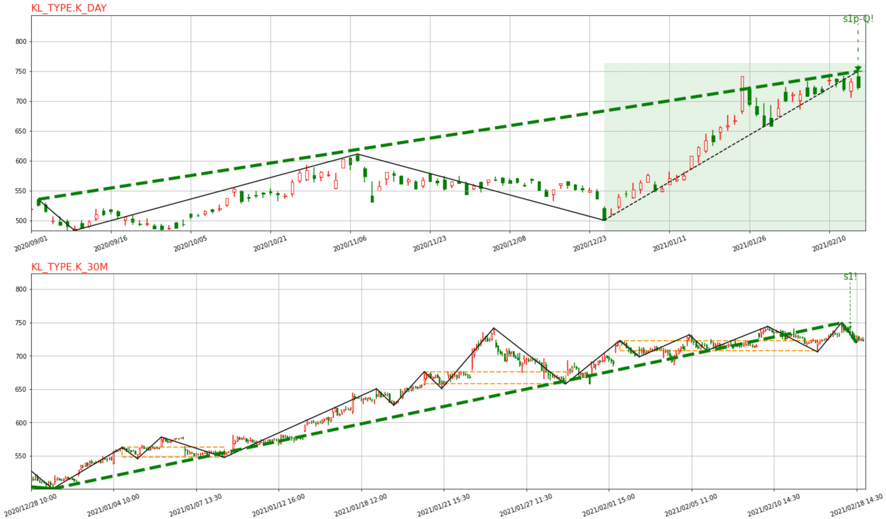

### 模型类
#### 模型开发
为了方便进行不同的机器学习模型的开发和评估，本框架提供了抽象模型生成类 `CModelGenerator` 和抽象数据类 `CDataSet`，基于这两个类分别实现响应的抽象方法，即可调用 `CModelGenerator` 中的 `trainProcess`,`PredictProcess` 来实现对所有数据的训练，预测和评估；

比如 XGB 模型，CModelGenerator 继承类需要描述 xgb.Booster，CDataSet 的继承类需要实现 DMatrix 的一些读写方法，而对于深度学习，CModelGenerator 继承类需要描述网络结构，而 CDataSet 的继承类则对应于 TFRecord 的操作；

##### CModelGenerator
CModelGenerator 的子类需要实现以下 6 个方法：
```python
@abc.abstractmethod
def train(self, train_set: CDataSet, test_set: CDataSet) -> None:
    # 训练后将模型赋值给self.model_info.model
    ...

@abc.abstractmethod
def create_train_test_set(self, sample_iter) -> Tuple[CDataSet, CDataSet]:
    # 自定义逻辑实现如何划分训练集和测试集，返回训练集和测试集的CDataSet
    ...

@abc.abstractmethod
def save_model(self):
    # 实现如何将模型self.model_info.model保存到self.GetMetaPath()这个路径下
    ...

@abc.abstractmethod
def load_model(self) -> int:
    # 加载模型，并返回所需特征维度
    ...

@abc.abstractmethod
def predict(self, dataSet: CDataSet) -> List[float]:
    # 返回预测结果
    ...

@abc.abstractmethod
def create_data_set(self, feature_arr: List[List[float]]) -> CDataSet:
    # 实现如何从描述N个样本M个特征的二维数组生成CDataSet
    ...
```

比如 XGB 可以实现：
```python
class CXGBTrainModelGenerator(CModelGenerator):
    def __init__(
        self,
        model_tag,
        is_buy=None,
        market=None,
        bsp_type=None,
        folder_thred=None,
        xgb_params=None,
    ):
        super(CXGBTrainModelGenerator, self).__init__(
            model_type='xgb',
            model_tag=model_tag,
            is_buy=is_buy,
            market=market,
            bsp_type=bsp_type,
            folder_thred=folder_thred
        )
        self.xgb_params = xgb_params

    def train(self, train_set: CDataSet, test_set: CDataSet) -> None:
        ...  # 自己实现，读取self.xgb_params

    def create_train_test_set(self, sample_iter) -> tuple(CDataSet, CDataSet):
          # 自己实现
        ...

    def save_model(self):
        self.model_info.model.save_model(self.GetModelPath())

    def load_model(self) -> int:
        bst = xgb.Booster(model_file=self.GetModelPath())
        self.model_info.model = bst
        return bst.num_features()

    def predict(self, dataSet: CDataSet) -> List[float]:
        return self.model_info.model.predict(dataSet.data)

    def create_data_set(self, feature_arr: List[List[float]]) -> CDataSet:
        return CDataSet(xgb.DMatrix(feature_arr))
```

##### CDataSet
CDataSet 的定义如下：

```python
class CDataSet:
    def __init__(self, data, tag='tmp'):
        self.data = data
        self.tag = tag

    @abc.abstractclassmethod
    def get_count(self):
        ...

    @abc.abstractclassmethod
    def get_pos_count(self):
        ...

    @abc.abstractclassmethod
    def get_label(self):
        ...
```

需要实现三个方法，分别是获得样本数量，获得正样本数量，获取 label；其中 `self.tag` 可以用来标识训练集，测试集；而 `self.data` 则是该模型所可以直接读取的数据本身；

比如 XGB 可以实现如下，其中 self.data 应该是 `xgb.DMatrix` 类
```python
class CXGB_DataSet(CDataSet):
    def __init__(self, data, tag='tmp'):
        super(CXGB_DataSet, self).__init__(data, tag)

    def get_count(self):
        return len(self.get_label())

    def get_pos_count(self):
        return sum(self.get_label())

    def get_label(self):
        return self.data.get_label()
```

##### 外部接口
实现了上面两个类之后：
- 调用 `CModelGenerator.trainProcess()` 即可实现对买卖类型，不同地区股票不同买卖类型，不同买卖点进行训练生成模型和评估结果；

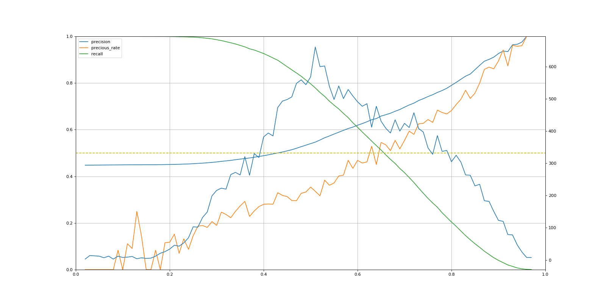

- 调用 `CModelGenerator.PredictProcess()` 即可实现对回测特征文件全部或部分进行预测
- 调用 `CModelGenerator.predictAllProcess()` 即可用所有模型对回测特征文件进行打分，并生成所需要的分数，特征文件，可以直接对接到本框架提供的 automl 方法中；

#### 模型接入
为了可以在缠论框架中读取生成的模型，并在计算过程中对 cbsp 进行实时打分，需要实现一个类继承自 `CCommModel`，并设置为配置 `CChanConfig.model`;
抽象类如下：
```python
class CCommModel:
    def __init__(self, path):
        self.load(path)

    @abc.abstractmethod
    def load(self, path):
        ...

    @abc.abstractmethod
    def predict(self, cbsp: CCustomBSP) -> float:
        # 取出cbsp.features，构造成模型所需要的输入，返回预测值即可
        ...
```

注意，往往加载模型并不仅仅是加载模型文件本身，模型生成时应该还有对应的 meta 文件，用于描述特征名和特征 index 的关系，这样就可以根据 `cbsp.features` 这个字典构造出模型文件 predict 接口所需要的输入 vector 了；

虽然 `CCommModel` 的输入只有 path 一个变量，但是下游实现具体方法的时候可以任意复杂，比如管理多个模型文件，cbsp.code 根据是 A股，港股，美股，指数的不同去调用不同的模型来打分；

#### Automl
对于一个模型，虽然训练时可以对评估集计算一些诸如 AUC 的机器学习指标，但是仍无法让我们知道诸如以下这些问题的答案：
- 什么样的阈值可以获得更高的盈亏比
- 这个模型是不是在 A股上比美股上效果更好
- 这个模型在什么类别的买卖点上盈利情况更好
- 这个模型在多少个中枢后的一类买卖点效果更好；
- 止损，止盈应该怎么设置；

其根本原因在于：仅仅对 cbsp 打分，是无法关注到策略的平仓行为的，对 cbsp 预测得再准，如果止损或者止盈点设置不同，也会获得不同的结局；

所以本框架首先实现了一个策略在离线数据中的评估类 `eval_strategy.py`，输入所需要的策略配置（比如买卖点阈值，模型策略，对不同类别的买卖店的不同特征值进行过滤，止盈止损配置，评估股票集合，评估时间段等），即可返回评估结果，包含盈亏比，交易次数，回撤，所需成本，最大持股数，收益，各个股票获利情况等信息；

有了上述的框架类，再实现一个 Automl 的框架 `para_automl.py` 中实现，配置所需要的AutoML算法（提供了贝叶斯优化，PBT，暴力搜索），需要搜索的参数和范围，初始值，以及一个打分函数；

那么随着AutoML轮数的迭代，会返回一个打分函数尽可能高的参数配置；

对于 `para_automl.py` 的返回结果（包含所有探索过的配置和结果），可以借助 `parse_automl_result.py` 生成线上交易引擎可以直接使用的配置 yaml；

## 其他
### COS
交易引擎在开仓时会推送股票，止损点，价格，分数之类的信息；为了方便在推送时附带上缠论绘制的图片，所以需要一个可以上传图片的地方，所以本项目实现了两个基于cos的上传接口，即项目中`Plot/CosApi`下的实现；

首选需要在`config.yaml`中配置上COS相关的信息（设计账号密码，桶名称之类的），自己开发使用时，可以直接调用`CPlotDriver.Upload2COS(path=None)`实现自动上传并获得url；

```python
chan = CChan(
        code=code,
        begin_time=begin_time,
        end_time=end_time,
        data_src=data_src,
        lv_list=lv_list,
        config=config,
        autype=AUTYPE.QFQ,
        extra_kl=None,
    )

plot_driver = CPlotDriver(
    chan,
    plot_config=plot_config,
    plot_para=plot_para,
)
print(plot_driver.Upload2COS())
```

交易引擎已内嵌实现了该调用：

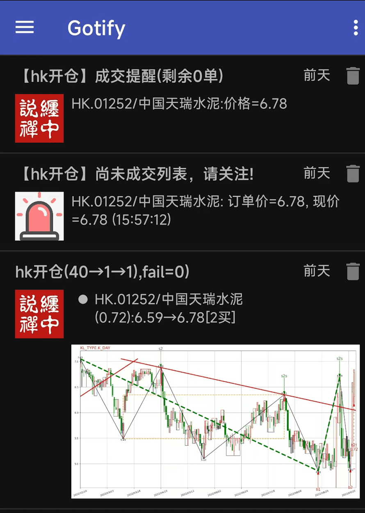

### Notion
如果在`config.yaml`中配置了Notion相关的信息，例行脚本中会调用`Script/Notion/DB_sync_Notion.py`将已开仓过的股票的操作数据同步至Notion制定的表中；并且会把开仓图片嵌入对应的页面中；

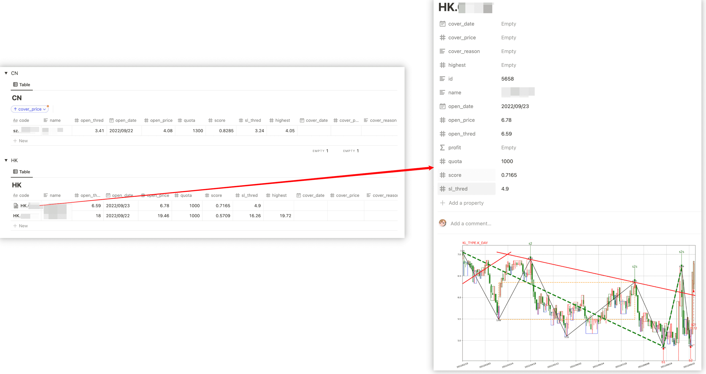

### 试题功能
此功能源于网上大家提到的一个问题：走势为什么往往是走出来之后才恍然大悟；

所以基于此脑洞了一个功能，根据用户输入的条件（什么地区的股票，什么类型买卖点，买还是卖，背驰率等等等等），随机生成一道测试题；

使用方法如下：
```python
from ExamGenerator import CQuestion

config = {  # 即CChanConfig所使用的配置文件规则
    "min_zs_cnt": 1,
    "bs_type": '1,1p',
}

Q = CQuestion(area='cn', begin_time='2010-01-01', kl_type=KL_TYPE.K_DAY, _config=config)  # 试题引擎
if Q.QuestionGenerator(is_buy=True):  # 尝试随机获取一只股票，生成符合条件的买卖点
    Q.PlotTestFigure(kl_type_lst=None)  # 绘制题目，其中kl_type_lst默认为试题引擎的kl_type，也可以指定绘制多个级别
else:
    print("not cbsp found")

# 给出判断后可以查看答案绘图：
Q.PlotAnswerFigure()
```

其原理就是几行代码实现了个如果cbsp分形完成，就输出的策略（参见`CustomBuySellPoint/ExamStrategy.py`）；

绘制的题目效果如下：

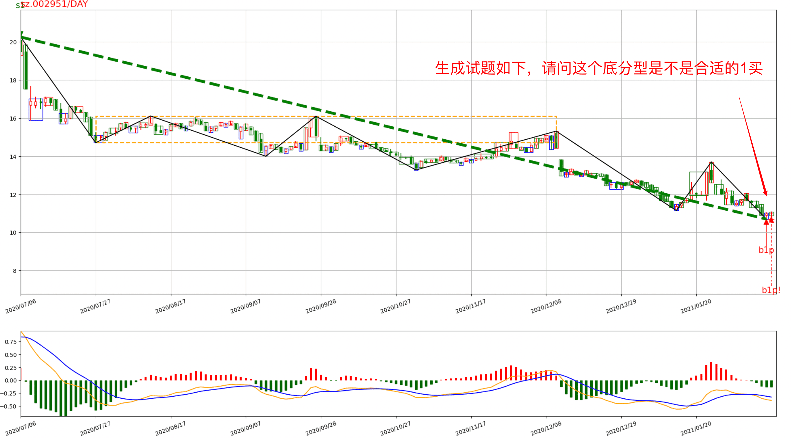

答案效果如下：

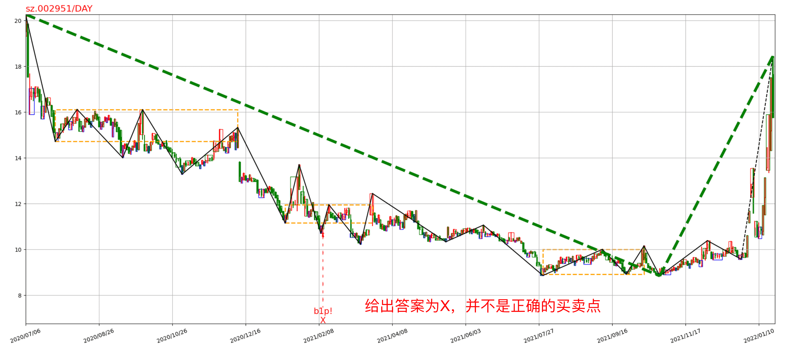

> 如果有自定义绘制开发需求，可以直接修改`ExamGenerator.py`文件，就三个函数。。。如果有人对这个感兴趣，回头可以做成一个APP/小程序/网页供大家玩耍。

## 其他不值一提的优化
除去上面所说的，还有很多细节的东西没有展开讲，比如
- 交易系统频率如何控制
- 离线数据更新复权时处理逻辑
- 如何通过缓存机制提高笔，段，买卖点的计算效率，如何能保证正确性
- 如何防止特征穿越
- 保证在线离线回测特征一致性校验原理
- 如何保证交易流程调度顺序正确性
- 交易脚本重启如何恢复现场
- 检测大小级别K线数据不一致（比如次级别或者父级别少了数据，对应不上）
- 如何量化 MACD 回抽零轴现象
- 如何在非常短的时间内完成大量的股票的形态学计算后开仓
- ...等等等等，想到再补。。

## 碎碎念
第一，我并不觉得缠论一定有用；之所以选择缠论，仅仅是因为觉得它最基础的笔段划分的方法非常适合代码实现拆解走势而已；

第二，我并不觉得有办法证明缠论没用（没人能证明自己使用缠论的方法是对的）；

第三，【非常关键】这可能实现的不是真正的缠论，只是我自己理解下的缠论，因为我原著都没看过（如果有和真正缠论理解相悖的，我也不一定会往那边靠拢）；

第四，其实这个 chan.py 已经是第三版了，正在实现第四版中。。

这个框架的起因是因为对某只股票走势研究后发现了某种规律，然后来回捡了几波钱，然后就在想，能否把所有股票里面符合这种规律的通过编程找出来(看下面的文档也可以发现其实很多优化和设计思路都是朝着对海量股票进行计算筛选方向搞的)；既然需要编程，就需要某种量化手段；搜索了一番之后，发现缠论可能是找到的资料里面最接近可以编程实现那个规律的了（虽然并不完全符合）；

于是乎，简单找了一下教程和课程后，就开始着手搞了；但是搞了许久发现，其实因为我囫囵吞枣的缘故，很多概念一开始并没弄懂，比如走势可以递归；还有就是一开始设计的只想计算分形，笔，线段之类的，代码难以扩展；

然后，第二版应运而生，就是重零开始从头开发；继而实现了这个框架里的大部分功能，除了缠论最基本的笔段，买卖点，自定义动力学策略，甚至到了特征，Automl，模型，并对接了富途的交易 API，上线了一个自己开发的策略后在模拟盘纯自动地跑了两个月；

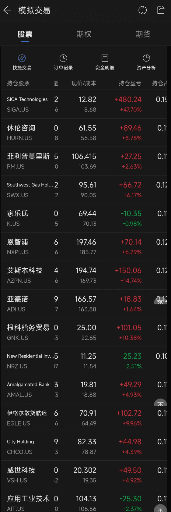

V2 就是最早发上 github 的这一版，这一版有个很严重的问题，因为 V2 堆了太多功能，且不说代码 hardcode 了太多东西（比如各种文件路径啥的），可扩展性比较差，上一个新策略都要改动和调试很多文件（这也就是 V2 github 上很多文件没公开的原因）；而且交易系统那里更是完全对接了自己服务器的各种环境，无法服用；

于是乎，整整花了三四个月，几乎把所有文件都重构了一遍，支持全局配置项，提供安装脚本，统一汇总管理所有特征，开放各个模块自定义能力，一键完成整个 pipeline 部署和模型训练等等等等；

整个项目回过头来看还是很有成就感的，由于个人原因，不太喜欢直接用太多外部的库，所以这个项目里面很多很基础的东西都是手动实现的，比如 MACD，布林线，趋势线，所有画图元素和逐帧动画，回测评估, automl等；

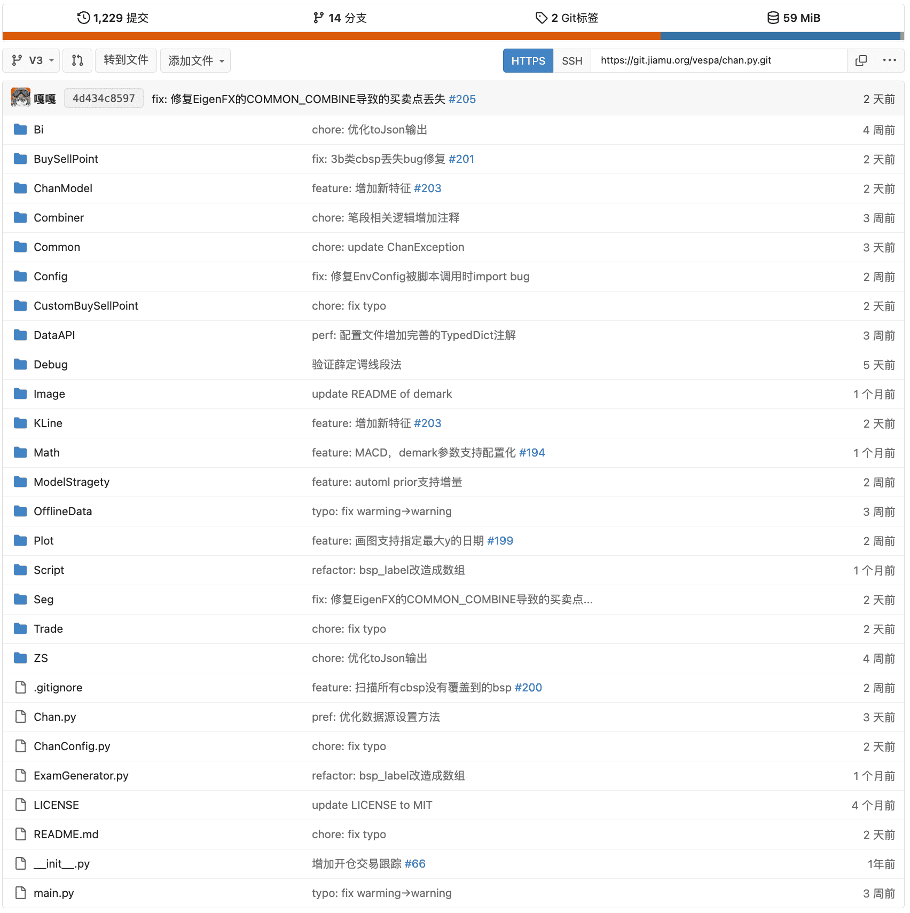

至今为止，总代码行19000+行，下图是至今为止的开发时间热力图，显示花了615个小时，但估计总体应该超过700个小时了，因为花在 jupyterlab 上画图调试的时间无法算在里面；V3的重构也差不多花了300个小时了；

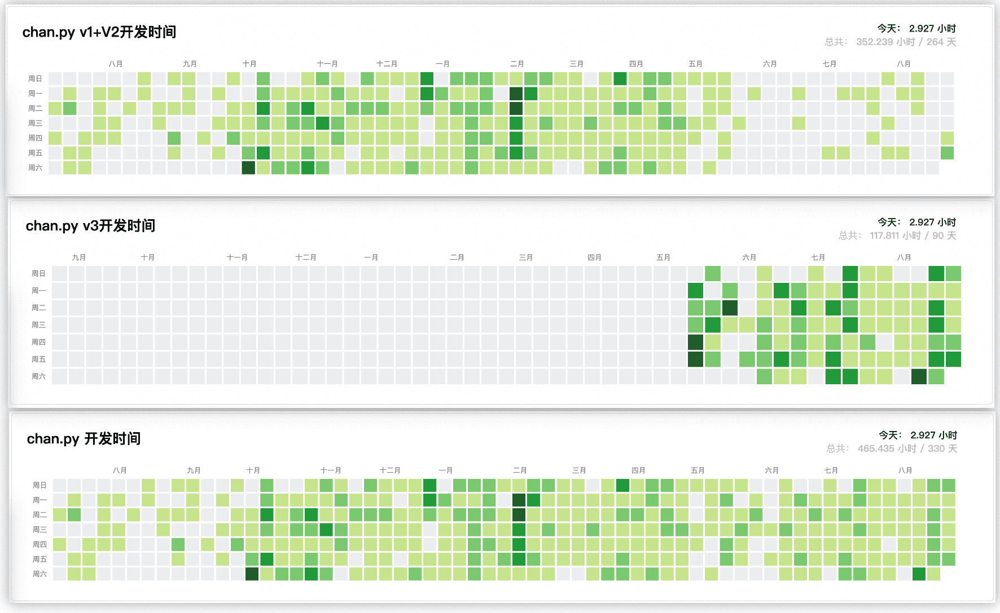

总共提了差不多196个 issue，1229+次commit：

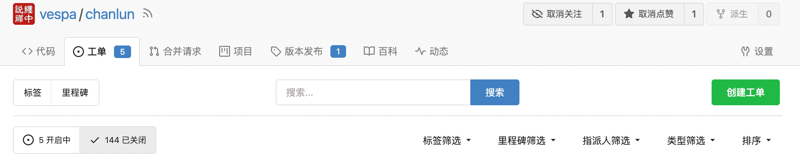
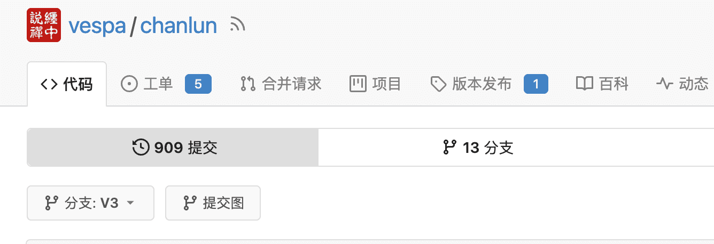

最近这两周一边上模拟盘跑（A股美股港股全部股票都是候选股票，纯自动化，下图是接入自己的推送系统显示的消息），一边优化+修bug，离最终形态大概已经完成了99%了，总体上使用体验符合预期；

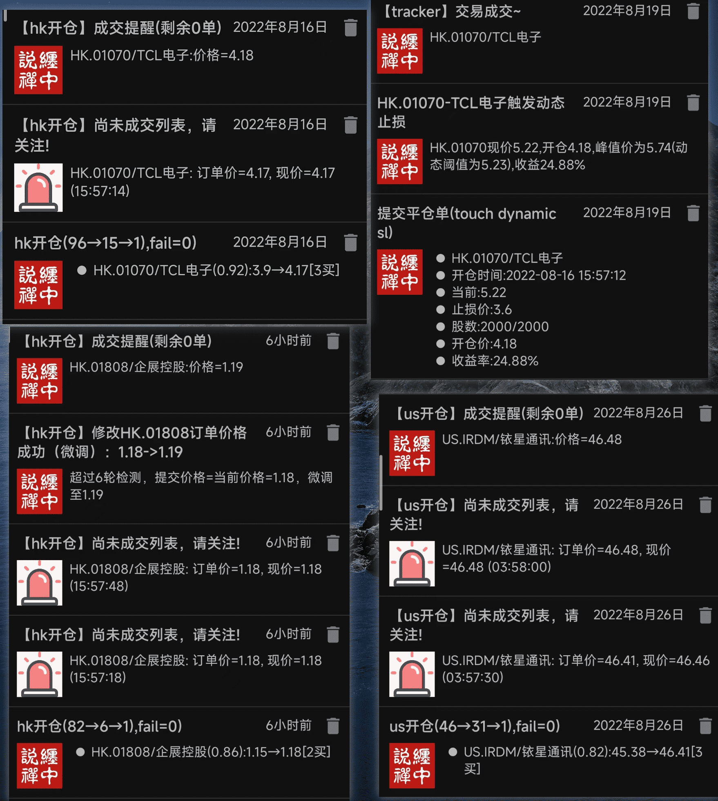

不过我还有一个很想实现但是完全没法开工的远景，就是上面这些绘图的功能全部搬上web端，并且实现可交互，无奈我并不懂这些东西，时间上也不太允许；

总之文档写了很多，估计也没几个人能读的完，具体的详细讲解可以看B站的[交流会视频](https://www.bilibili.com/video/BV1nu411c7oG/);


### 12月15日补充
10月14日开始进行了模拟盘&实盘同步运行，因为使用的是富途，所以跑的是美股和港股；


#### 实验仓位
没有专门的仓位控制策略，所以采用策略如下：
```python
class COpenQuotaGen:
    @classmethod
    def bench_price_func(cls, bench_price):
        def f(price, lot_size) -> int:
            quota = lot_size
            while quota*price < bench_price:
                quota += lot_size
            return quota
        return f
```
即买的手数为让开仓金额大于`bench_price`的最小值，模拟盘采用的是10000，实盘是2000；（富途评估收益率的分母是提供的总模拟金额100万，所以在仓位不高的情况下收益率显示总是很低；）

全程两个月除了bug修复外，全程零工人干预；实验效果如下：

#### 港股

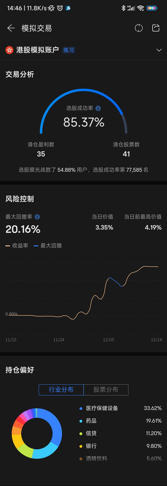

#### 美股

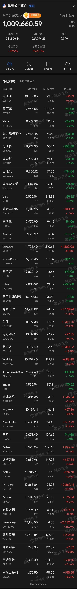

效果看起来还行，不过我并不太确定是大行情问题还是策略问题，所以还需要再观察观察；

以上！

## Star history


## 咖啡？NO!
如果你觉得这个项目对你有帮助或有启发，可以请我喝一杯。。额。。咖啡和牛奶以外的东西，毕竟我喝这两种会拉肚子。。

