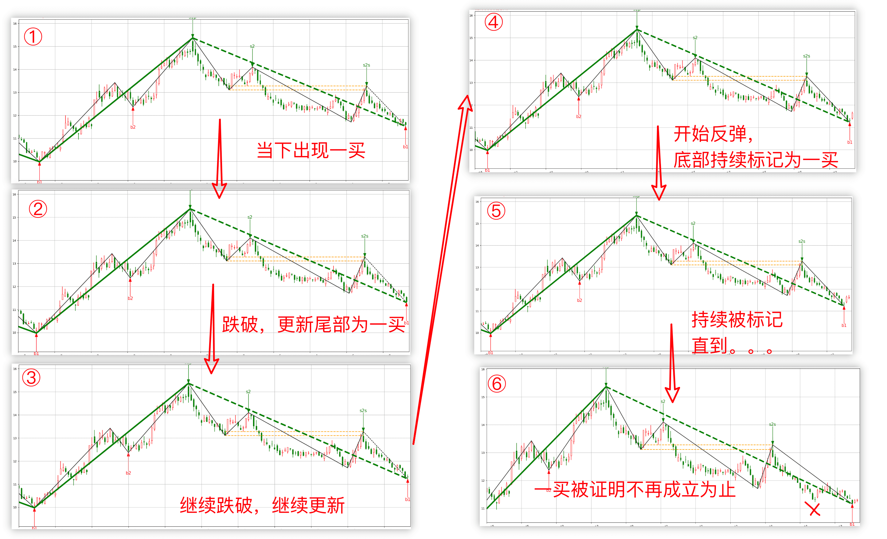

# 快速上手指南

- [快速上手指南](#快速上手指南)
  - [写在前面](#写在前面)
  - [如何开始](#如何开始)
  - [框架核心能力](#框架核心能力)
    - [关于“当前帧”的详细说明](#关于当前帧的详细说明)
    - [关于is\_sure标记](#关于is_sure标记)
    - [你需要做的](#你需要做的)
  - [可能遇到的问题](#可能遇到的问题)
    - [运行报错](#运行报错)
    - [运行完啥也没有](#运行完啥也没有)
    - [README里面有些文件为啥仓库里面没有](#readme里面有些文件为啥仓库里面没有)
    - [关于完整版](#关于完整版)
    - [为啥信号会消失](#为啥信号会消失)
    - [画图为啥不能交互](#画图为啥不能交互)
    - [关于动态图](#关于动态图)
    - [CChan类序列化/deepcopy时报递归溢出](#cchan类序列化deepcopy时报递归溢出)
    - [报k线时间相关错误](#报k线时间相关错误)
    - [我觉得线段画的不太对](#我觉得线段画的不太对)
    - [其他问题](#其他问题)
  - [不可绕过的步骤](#不可绕过的步骤)
    - [CChanConfig重点关注配置](#cchanconfig重点关注配置)
  - [取出缠论元素](#取出缠论元素)
    - [CKLine-合并K线](#ckline-合并k线)
      - [CKLine\_Unit-单根K线](#ckline_unit-单根k线)
    - [bi\_list-笔管理类](#bi_list-笔管理类)
      - [CBi- 笔类](#cbi--笔类)
    - [CSegListComm-线段管理类](#cseglistcomm-线段管理类)
      - [CSeg：线段类](#cseg线段类)
    - [CZSList-中枢管理类](#czslist-中枢管理类)
      - [CZS：中枢类](#czs中枢类)
    - [CBSPointList-买卖点管理类](#cbspointlist-买卖点管理类)
      - [CBS\_Point：买卖点类](#cbs_point买卖点类)
  - [数据接入速成班](#数据接入速成班)
    - [CCommonStockApi子类实现](#ccommonstockapi子类实现)
    - [CTime](#ctime)
    - [初始化和结束](#初始化和结束)
    - [接入数据源](#接入数据源)
  - [线段](#线段)
    - [虚段](#虚段)
  - [中枢](#中枢)
  - [策略实现 \& 回测](#策略实现--回测)
    - [从外部喂K线](#从外部喂k线)
    - [更新小级别触发大级别重算](#更新小级别触发大级别重算)
  - [开源版本指标添加](#开源版本指标添加)
    - [指标画图](#指标画图)
  - [机器学习接入](#机器学习接入)
    - [机器学习分支和主分支区别](#机器学习分支和主分支区别)
  - [一致性](#一致性)
    - [如何防止未来信息](#如何防止未来信息)
  - [打赏](#打赏)


<p align="center">

</p>

```
             ██████╗██╗  ██╗ █████╗ ███╗   ██╗   ██████╗ ██╗   ██╗
            ██╔════╝██║  ██║██╔══██╗████╗  ██║   ██╔══██╗╚██╗ ██╔╝
            ██║     ███████║███████║██╔██╗ ██║   ██████╔╝ ╚████╔╝
            ██║     ██╔══██║██╔══██║██║╚██╗██║   ██╔═══╝   ╚██╔╝
            ╚██████╗██║  ██║██║  ██║██║ ╚████║██╗██║        ██║
             ╚═════╝╚═╝  ╚═╝╚═╝  ╚═╝╚═╝  ╚═══╝╚═╝╚═╝        ╚═╝
```


## 写在前面
- 为什么会有这个项目：我想自动化买卖股票 → 需要一套比较好的，容易程序化描述股票走势的理论 → 找到缠论 → 实现后顺便开源部分
- 为啥会开源：借助群众的力量，帮我优化找bug，顺便回馈群众～
- 开源部分包含什么：
  - 缠论元素（笔，线段，中枢，买卖点）的计算
- 开源部分不包含什么：
  - 策略：因为定制化很强
  - 交易引擎：因为不通用
  - 机器学习相关（特征/模型）
- **不包含策略，不包含策略，不包含策略**（再次强调）
- 关于开发/新增特性：
  - 不要找我开发，我不是外包
  - 如果特性对我有用，我会立马开发
  - 欢迎提交PR
- 什么东西不会发到开源版里
  - 非通用的，定制化的东西
  - 我解释/答疑起来会很麻烦的东西
  - 策略
    - 当然典型的策略的用法会放进demo里面
    - 也欢迎PR demo策略
- 免责声明：
  - 本人没读完原著
  - 本人不完全理解缠论交易思想
  - 实现细节可能不完全符合你所想
    - 可能实现的是我理解的缠论
  - README是完整版的描述，可能与开源版本不符
- 讨论组：<a href="https://t.me/zen_python">Telegram</a>
  - 为什么用TG：因为后进来的朋友可以看到以前的讨论（啥时候墙内也有类似的，我再开个讨论的）
  - 没法科学上网，没有tg账号：有问题可以邮件联系我
- 欢迎star，满足一下我的虚荣心
- 如有打赏，万分感谢！
- 视频介绍：[20230909交流会录屏](https://www.bilibili.com/video/BV1nu411c7oG/);


## 如何开始
`python3 main.py`即可体验


## 框架核心能力
一言以蔽之：
- 根据给定范围的K线，算出当前静态范围下的缠论元素
  - 框架对于各种元素都提供了不同的参数配置
- 基于上述能力，提供增加K线时的增量更新缠论元素
- 支持开发自己的数据源接入这个计算（参见[数据接入速成班](#数据接入速成班)）
- 支持让你取出算好的元素组装你自己的策略（参见[取出缠论元素组织策略](#取出缠论元素组织策略)）


### 关于“当前帧”的详细说明
框架支持计算指定时间范围内K线所组成的缠论元素，也支持逐根K线投喂更新已有的缠论元素；

任何时刻（比如每新增一根K线），都可以通过框架CChan这个类获得当下（到目前给定的K线为止）下所有缠论的元素（各种元素获取参见下文）；

> 而对于最重要的买卖点，可以理解成每次计算出来的都是当下的“形态学”买卖点；只不过有些买卖点不是已经确定的，可能在将来消失；

所以随着K线的新增，你可能会发现某个位置的买点突然消失的，或者一个买卖点的位置一直在变动；

举个例子：
- 在某下降线段尾部单边下跌的一笔中（即每根新增K线的低点都比上一根更低），那么每新增一根K线，这根K线都可能在“当下”被标识为一类买卖点，而上一根K线的标识被取消；
- 如果某根K线之后开始反弹，那么在最低点这根K线被跌破之前，新投喂K线后这根最低点的K线会一直被**持续**标记为一买
- 直到形态上认为这个一买不再成立



### 关于is_sure标记
框架会对所有元素都标明是否已经确定（或者说已经完成），可以参见各个类的is_sure属性；

is_sure=False在画图结果中表现为虚线（虚笔，虚段，虚线中枢）；

对于is_sure=True的元素，在后续K线新增的过程中，这些元素不会再被变更，也不可能会被标记为is_sure=False;

而且is_sure=False的元素只可能出现在所有K线的头部或者尾部；

### 你需要做的
根据上面所言，框架会一直给你提示当下这一“帧”里面的缠论元素分别是什么样子；

随着K线的投喂，可能很多K线都曾经在某个时候被标记为“当下”的买卖点（而且这些买卖点大部分is_sure=False）；

对于那些不确定是否将来最终会成立的买卖点，你需要自己开发策略判断这些买卖点是否最终会成立，或者当下是否需要交易（比如考虑买卖点的背驰度，中枢数之类的）；

> 其中需要特别说明的是，由于走势的多义性，而框架在任何一个时刻只能给出一种缠论元素的计算结果，所以必然存在某些将来成立的买卖点，在K线新增的全过程中，一次都不曾被标记为买卖点过；（当然破解方法也比较简单，每根K线进来后跑两组不同的缠论计算参数）

> 而我比较偷懒，把这块策略判断的实现企图通过机器学习模型来解决；


## 可能遇到的问题
### 运行报错
依赖最低版本为python3.11；由于本项目是高度计算密集型，鉴于python3.11发布且运算速度大幅提升，实测相比于python 3.8.5计算时间缩短约16%，故后续开发均基于python3.11；

### 运行完啥也没有
某些系统画图窗口可能会在程序运行完后自动关闭，常用解法：
- 在jupyter notebook之类应用上运行
- 在代码最后加上一句`input()`

### README里面有些文件为啥仓库里面没有
README.md文件主要为个人完整版撰写，对于开源版，主要查考此 quick_guide.md 即可；

另外，画图/CChanConfig等配置，框架里面一些定义解释可以参考README，其他的看 README 意义不大。

### 关于完整版
首先，完整版和开源版的区别参见[写在前面](#写在前面)章节，差异部分主要为个人策略和交易引擎**定制开发**的代码，不具备可泛化性，各位拿了也没啥用！

> 另外机器学习模型相关的代码和一些特征，也由于并非所有知识产权都归属于我，所以是没法对外提供的。
> 关于这部分的思路，B站发的[交流会视频](https://www.bilibili.com/video/BV1iB421k74C/)基本已经介绍过了，感兴趣的可以去看看。

其次，开源的部分提供了所有可以用到的基座和演示代码，已经足够大家自行用于组装自己的策略。

最后，不要再找我买完整版代码了，内部自用策略，而且此项目开发时间已超过一千小时，按照时薪计算也不是大家可以负担得起的。

### 为啥信号会消失
大家所说的信号，应该就是框架计算出来的买卖点（bsp）；

因为框架计算得永远都是“当前帧”下的缠论元素，随着K线的增加，原有的买卖点可能会被证明不成立（比如跌破一买），那么原本位置会被标记为买卖点的K线将不再被标记为bsp；


### 画图为啥不能交互
框架提供的默认画图能力其实是对接的matplotlib这个库，如果你希望在别的画图引擎上实现（比如某些web页面，或者ploty这种可交互的库），欢迎PR代码~

框架提供了一个画图元素类PlotMeta，里面提供了各种元素在绘图时的坐标信息（比如已经完成了K线时间到X轴坐标的转化了），方便自行对接到不同的画图引擎上；

### 关于动态图
问：使用 main.py 里面画动态图特别吃内存，32G都不够用，而且会越来越卡；
答：动图是一个纯实验性功能，内存泄露是已知问题，只是作为演示，多年没优化过了，欢迎各位感兴趣的提PR进行优化～

### CChan类序列化/deepcopy时报递归溢出
原因：框架里面很多缠论元素类都有一个next/pre成员指向了上一个/下一个元素，python导出时可能会遇到递归导致溢出问题；
解决方法：加一行配置，增加系统递归深度

```python
sys.setrecursionlimit(0x100000)
```

### 报k线时间相关错误
常见报错类似：`kline time err, cur=2024/01/01 00:05, last=2024/01/01`

处理方法：如果数据级别为天级别以下（不包含天级别），且K线时间可能出现0点0分数据，那么在数据源类中返回的K线时间CTime中，把auto设置为False即可；

根本原因：一般日线K的时间都不包含小时信息，或者为0点0分，为了处理天级别+分钟级别K线时间对齐问题，auto 设置为 True（这是默认设置）则会自动将天的小时分钟信息设置为23:59，从而保证当天的分钟线为对应日期的次级别K线；但是对于数字货币类的分钟K线，如果也出现0点0分，则会有误判；

### 我觉得线段画的不太对
线段逻辑简要说明可以参考[线段](#线段)一章，如果不太能理解划段的结果，可以在画图开关里面打开`plot_eigen`开关绘制出特征序列辅助分析。

如果还有问题，只能联系作者了。。

### 其他问题
如需作者排查，尽量提供可以直接运行的主函数文件和数据文件；


## 不可绕过的步骤
很多用户使用，其实不需要细看整个代码是怎么实现了，假装相信框架没BUG，通过直接提取框架计算好的缠论元素来组装策略（具体内部元素结构的设计参见[B站视频](https://www.bilibili.com/video/BV1nu411c7oG/)）；

但是即便如此，以下三部分建议先读README文件了解下；

- 了解CChan这个类的输入参数及格式
- 了解CChanConfig接受的配置：默认配置基本可用，关注自己想了解的即可
- 如果涉及画图，了解画图的两个配置
  - plot_config：需要画什么
  - plot_para：画的每种元素单独配置

然后通过画图，可能找到一些不合理的地方（笔段中枢买卖点算错或漏算之类的），再具体去看实际实现细节或者反馈给作者。

这些README里面都有细讲。。

### CChanConfig重点关注配置
CChanConfig里面提供了很多的配置，其中很多人最容易被影响到自己计算结果的主要是这几个，它们的含义最好再仔细阅读一下readme相关解释：
- bi_strict：是否只用严格笔，默认为 Ture，其中这里的严格笔只考虑顶底分形之间相隔几个合并K线
- bi_fx_check：检查笔顶底分形是否成立的方法
- bi_end_is_peak: 笔的尾部是否是整笔中最低/最高, 默认为 True
- divergence_rate：1类买卖点背驰比例，即离开中枢的笔的 MACD 指标相对于进入中枢的笔，默认为 0.9
- min_zs_cnt：1类买卖点至少要经历几个中枢，默认为 1
- max_bs2_rate：2类买卖点那一笔回撤最大比例，默认为 0.618
    - 注：如果是 1.0，那么相当于允许回测到1类买卖点的位置
- zs_algo: 中枢算法，涉及到中枢是否允许跨段

## 取出缠论元素
- CChan这个类里面有个变量`kl_datas`，这是一个字典，键是 KL_TYPE（即级别，具体取值参见Common/CEnum），值是 CKLine_List 类；
- CKLine_List是所有元素取值的入口，关键成员是：
  - lst: List[CKLine]：所有的合并K线
  - bi_list：CBiList 类，管理所有的笔
  - seg_list：CSegListComm 类，管理所有的线段
  - zs_list：CZSList 类，管理所有的中枢
  - bs_point_lst：CBSPointList 类，管理所有的买卖点
  - 其余大部分人可能不关注的
    - segseg_list：线段的线段
    - segzs_list：线段中枢
    - seg_bs_point_lst：线段买卖点


### CKLine-合并K线
成员包括：
- idx：第几根
- CKLine.lst可以取到所有的单根K线变量 CKLine_Unit
- fx：FX_TYPE，分形类型
- dir：方向
- pre,next：前一/后一合并K线
- high：高点
- low：低点

#### CKLine_Unit-单根K线
成员包括：
- idx：第几根
- time
- low/close/open/high
- klc：获取所属的合并K线（即CKLine）变量
- sub_kl_list: List[CKLine_Unit] 获取次级别K线列表，范围在这根K线范围内的
- sup_kl: CKLine_Unit 父级别K线（CKLine_Unit）


### bi_list-笔管理类
成员包含：
- bi_list: List[CBi]，每个元素是一笔

这个类的实现基本可以不用关注，除非你想实现自己的画笔算法

#### CBi- 笔类
成员包含：
- idx：第几笔
- dir：方向，BI_DIR类
- is_sure：是否是确定的笔
- klc_lst：List[CKLine]，该笔全部合并K线
- seg_idx：所属线段id
- parent_seg:CSeg 所属线段
- next/pre：前一/后一笔

可以关注一下这里面实现的一些关键函数：
- _high/_low
- get_first_klu/get_last_klu：获取笔第一根/最后一根K线
- get_begin_klu/get_end_klu：获取起止K线
  - 注意一下：和get_first_klu不一样的地方在于，比如下降笔，这个获取的是第一个合并K线里面high最大的K线，而不是第一个合并K线里面的第一根K线；
- get_begin_val/get_end_val：获取笔起止K线的价格
  - 比如下降笔get_begin_val就是get_begin_klu的高点


### CSegListComm-线段管理类
- lst: List[CSeg] 每一个成员是一根线段

这个类的实现基本可以不用关注，除非你想实现自己的画段算法，参照提供的几个demo，实现这个类的子类即可；

#### CSeg：线段类
成员包括：
- idx
- start_bi：起始笔
- end_bi：终止笔
- is_sure：是否已确定
- dir：方向，BI_DIR类
- zs_lst: List[CZS] 线段内中枢列表
- pre/next：前一/后一线段
- bi_list: List[CBi] 线段内笔的列表

关注的一些关键函数和CBi里面一样，都已实现同名函数，如：
- _high/_low
- get_first_klu/get_last_klu
- get_begin_klu/get_end_klu
- get_begin_val/get_end_val


### CZSList-中枢管理类
- zs_lst: List[CZS] 中枢列表


#### CZS：中枢类
成员包括：
- begin/end：起止K线CKLine_Unit
- begin_bi/end_bi：中枢内部的第一笔/最后一笔
- bi_in：进中枢的那一笔（在中枢外面）
- bi_out：出中枢的那一笔（在中枢外面，不一定存在）
- low/high：中枢的高低点
- peak_low/peak/high：中枢内所有笔的最高/最低值
- bi_lst：中枢内笔列表
- sub_zs_lst：子中枢（如果出现过中枢合并的话）


### CBSPointList-买卖点管理类
- lst：List[CBS_Point] 所有的买卖点


#### CBS_Point：买卖点类
成员包括：
- bi：所属的笔（买卖点一定在某一笔末尾）
- Klu：所在K线
- is_buy：True为买点，False为卖点
- type：List[BSP_TYPE] 买卖点类别，是个数组，比如2，3类买卖点是同一个


## 数据接入速成班
### CCommonStockApi子类实现
参考`DataAPI/BaoStockAPI.py`，实现一个类继承自`CCommonStockApi`，接受输入参数为：
- code
- k_type: KL_TYPE类型
- begin_date/end_date：能不能为None，应该是什么格式自行决定，会通过CChan类的初始化参数传进来；

并在该类里面实现一个关键方法：

`get_kl_data(self)`：该方法为一个生成器，yield 返回每一根K线信息 `CKLine_Unit`，K线类可以通过`CKLine_Unit(item_dict)`来实例化；

| 当然你也可以直接返回一个有序的数组，每个元素为`CKLine_Unit`，只不过性能可能会差一些；

```python
class C_YOUR_OWN_DATA_CLS(CCommonStockApi):
    def __init__(self, code, k_type=KL_TYPE.K_DAY, begin_date=None, end_date=None, autype=AUTYPE.QFQ):
        super(C_YOUR_OWN_DATA_CLS, self).__init__(code, k_type, begin_date, end_date, autype)

    def get_kl_data(self) -> Iterable[CKLine_Unit]:
       ...
       yield CKLine_Unit(item_dict)
```

item_dict为一个字典：
- 包含时间：必须是框架实现的CTime类
- 开收高低：必须要有
- 换手率，成交额，成交量：这三个可以没有

```python
{
    DATA_FIELD.FIELD_TIME: time,  # 必须是CTime
    DATA_FIELD.FIELD_OPEN: float(_open),  # 必填
    DATA_FIELD.FIELD_CLOSE: float(_close),  # 必填
    DATA_FIELD.FIELD_LOW: float(_low),  # 必填
    DATA_FIELD.FIELD_HIGH: float(_high),  # 必填
    DATA_FIELD.FIELD_VOLUME: float(volume),  # 可选
    DATA_FIELD.FIELD_TURNOVER: float(amount),  # 可选
    DATA_FIELD.FIELD_TURNRATE: float(turn),  # 可选
}
```

### CTime
构造`CTime(year, month, day, hour, minute)`实例即可；


### 初始化和结束
如果数据来源于其他服务，需要有初始化和结束的操作，那么需要额外重载实现两个类函数：
```python
  @classmethod
  def do_init(cls):
      ...

  @classmethod
  def do_close(cls):
      ...
```

比如baostock即需要实现login,logout操作，futu数据源需要初始化和关闭ctx操作；


### 接入数据源
最简单的方法就是把实现的类放在`./DataAPI/`目录下，然后`CChan`的`data_src`参数配置为`custom:文件名.类名`即可；


## 线段
框架默认提供的线段画法是基于特征序列那一套的，如果不了解，请搜索引擎搜索：“缠论 线段 特征序列”；

首先需要说明的是，线段这部分为整个框架代码里面最复杂，最绕，最难以维护的部分（主要是本人的锅，开发能力不够），如果不是作为挑战，或者有重要特性需要实现，没啥事不要尝试去挑战阅读。。

关于划段算法，简单来说，就是上线线段里面的下降笔（或者下降线段里面的上升笔）当做K线（也叫特征序列），进行合并后找顶底分析，主要区分两种情况（以上升线段为例）：
- 特征序列形成的顶分型第一二元素之间有跳空，那么需要在后面找到反向**且合法**的特征序列底分型，这个上升线段才会被判断为确认（即框架里面CSeg的is_sure=True，或者说画图为实线）；
- 如果没有跳空，那么顶分型出现时即被判断为确认。

当然，里面还有更多的细节，这里不展开赘述。

当然，开源代码里面也提供了一些其他的线段的实现算法（参见 SegListDYH.py, SegListDef.py 等），大家也可以自行开发；

### 虚段
线段的确定时刻实际上是具有很强的滞后性的，所以框架在计算“当前帧”的缠论元素的时候，会产生一些推断的线段（即框架里面CSeg的is_sure=False，或者说画图为虚线），这些虚段在后面新增K线产生的过程中，可能随时有可能会变化。

虚段可能出现在线段的开头和结尾，主要是框架认为当下的K线信息不足以确定一些线段，或者说特征序列的顶底分型尚未完成；

开头的虚段参考意义不大，但是建议大家如果给出的K线算出来的所有线段都是虚的，那么不要进行任何回测或者在上面交易，至少在出现一条实段后在进行策略分析。

## 中枢

## 策略实现 & 回测
具体demo参见[strategy_demo.py](./Debug/strategy_demo.py)

原理就是：打开CChanConfig中的`trigger_step`开关，那么CChan初始化的时候就不会做任何计算；

而手动调用CChan.step_load()，才会启动计算；
- 多少根K线就返回多少次
- 这个函数就是一个生成器：每喂一根K线后，就会计算当前K线位置的静态元素，返回当前的CChan类，可以用上文描述的方法来获取需要的元素；
- 每一帧的计算不是完全重算的，只重新计算不确定的部分，故计算性能还行

回测啥的就自行组装了~


### 从外部喂K线
实盘的时候需要在获取到K线之后触发缠论计算，可以使用`CChan.trigger_load`来触发计算；

其中该函数的输入参数格式为：`Dict[KL_TYPE, List[CKLine_Unit]]`

具体使用case可以参考[strategy_demo.py](./Debug/strategy_demo2.py)


### 更新小级别触发大级别重算
这种场景一般是：
- 实盘中使用了1分钟，5分钟两个级别来构建策略
- 每过一分钟，当前5分钟的K线由于数据源并没提供，是由1分钟K线合成的
  - 或者也有可能券商接口提供了当前5分钟的K线，但是由于没有完成，下一分钟这5分钟的K线可能会有变化
- 把这两个级别的K线用CChan.trigger_load()喂进去

问题是当你把当前的5分钟K线喂进去后，下一分钟框架无法回退掉/更新这个5分钟K线，而这个5分钟K线可能相较于前一分钟时所得是有变化的；

解决方法：参考[strategy_demo.py](./Debug/strategy_demo3.py)
原理是：
- 当某一个时刻所有级别的K线都在将来不需要变化时（比如每5分钟结束时），把当前CChan保存下来（不管是用深度拷贝保存成一个临时的变量或者序列化到本地文件）成一个快照
- 之后每根最小级别K线产生时，均重新加载这个快照重新计算当前的所有级别


## 开源版本指标添加
以实现RSI指标为例，只需要三步：

首先你需要实现一个计算类（见Math/RSI.py）：
- 类可以接收指标计算的参数（如周期等）
- 类对外提供一个方法：
  - 接收需要的K线信息（不要直接接收CKLine_Unit，不然后续可能会有循环引用问题）
  - 返回指标值，或者包含所有指标结果的一个类（比如MACD类需要返回快线慢线，红绿柱等信息）
  - tips：
    - 出于性能考虑，指标的计算尽量优化成增量计算，而不是当前K线的指标需要用前面所有K线的数据来算
    - 也就是新的一根K线+部分之前K线计算的中间结果，就可以算出当前K线的指标
    - 本框架所有开源指标均遵循此原则
    - 当然你自己开发的不在意计算效率的话，倒无所谓。。


然后在`CChanConfig`的GetMetricModel方法修改res变量的注解（增加你的指标类），然后append一个上面实现的指标计算实例(可以参考rsi实现方法在)CChanConfig里面配置指标计算的参数；
```python
    def GetMetricModel(self):
        res: List[CMACD | CTrendModel | BollModel | CDemarkEngine | RSI] = []
        # 其他已有指标
        # balabala....
        res.append(RSI(self.rsi_cycle))
        return res

```

最后在`CKLine_Unit`的set_metric方法最后增加一行，调用你实现的指标类的计算方法：
```python
    def set_metric(self, metric_model_lst: list) -> None:
        for metric_model in metric_model_lst:
            # balabala...
            elif isinstance(metric_model, RSI):
                self.rsi = metric_model.add(self.close)
```

至此，你就可以通过CKLine_Unit.rsi取得你的指标，参与后续计算了；

### 指标画图
如果你想你的指标支持绘制，PlotDriver.py的DrawElement方法增加一行：
```python
def DrawElement(self, plot_config: Dict[str, bool], meta: CChanPlotMeta, ax: Axes, lv, plot_para, ax_macd: Optional[Axes], x_limits):
    # balabala...
    if plot_config.get("plot_rsi", False):
        self.draw_rsi(meta, ax.twinx(), **plot_para.get('rsi', {}))
```

然后实现draw_rsi方法即可：
```python
def draw_rsi(self, meta: CChanPlotMeta, ax, color='b'):
    data = [klu.rsi for klu in meta.klu_iter()]
    x_begin, x_end = int(ax.get_xlim()[0]), int(ax.get_xlim()[1])
    ax.plot(range(x_begin, x_end), data[x_begin: x_end], c=color)
```


## 机器学习接入
缠论有个好处在于，基础元素的定义大多非常精确，包括买卖点，很容易用程序化语言来实现；

带来的好处就是，策略可以接入机器学习，让机器学习来判断当下状态，框架也可以较方便的接入这些能力；

机器学习相关演示参见项目`machinelearning`分支[strategy_demo5.py](./Debug/strategy_demo5.py)，里面演示了包括：
- 如何在bsp各个地方增加特征计算
- 如何在bsp里面增加通用特征
- 策略如何与bsp特征联动
  - 如何在策略生效时新增策略特征
- 如何绘图分析label是否正确
- 如何训练 & 预测

### 机器学习分支和主分支区别
机器学习分支仅仅在主分支基础上，在 CChan 内部增加了一些特征计算演示的 demo，和机器学习特有的一些 demo策略。

主分支的所有特性都会合并进机器学习分支，只是额外的特征计算会消耗计算性能，考虑到不是所有人都需要机器学习特征计算，所以专门开了个分支；

不介意性能的话，无脑用机器学习分支亦可。


## 一致性
上面提到框架支持两种计算模式：
- 直接给定一批K线，计算出所有缠论元素
- 在已有（可以为空）K线基础上，逐根K线投喂更新得到“当下为止”的缠论元素

两种方法实现上略有区别，前者计算速度快于后者；

但是可以保证（或者说目标是要保证）：如果给定同样范围的K线，那么两种模式最终计算状态应该是完全一致的！（如果不一致，说明有bug，联系作者排查）

### 如何防止未来信息
如果你使用`CChan.trigger_load`来触发计算，那么每次触发后框架只拿到当前位置的 K 线数据来进行计算缠论元素，你只要在下一次trigger_load之前完成策略的判断，那么你的策略模型在没有 Bug 的情况下，是拿不到未来信息的。

## 打赏
如果你觉得这个项目对你有帮助或有启发，可以请我喝一杯。。额。。咖啡和牛奶以外的东西，毕竟我喝这两种会拉肚子。。


